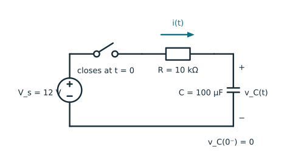
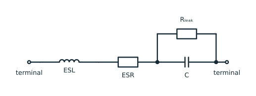

## What you will learn

After this tutorial, you will be able to:

- use the constitutive relations $q=Cv$ and $i=C\,dv/dt$;
- explain why voltage of an ideal-capacitor cannot jump instantaneously;
- calculate electric energy and sinusoidal reactance;
- interpret a capacitor during a DC charging transient; and
- recognize the limitations of the ideal model.

## Prerequisites

- Voltage, current, power, and basic derivatives.
- [Complex numbers](complex-numbers-in-ac-circuits.qmd) and [RMS values](effective-rms-value-in-ac-circuits.qmd) for the sinusoidal section.

## 1. The ideal capacitor

A **capacitor** is a two-terminal component that stores energy in an electric field. Its defining parameter is the **capacitance** $C$, measured in the [SI unit farads (F)](https://en.wikipedia.org/wiki/Farad).

For an ideal linear capacitor, charge and voltage are related by

$$
q(t)=C v(t).
$$ {#eq-capacitor-charge}

Here, $q(t)$ is the **instantaneous charge at time $t$**. The integral of current gives the change in charge:

$$
q(t)=q(t_0)+\int_{t_0}^{t}i(\tau)\,d\tau.
$$

Differentiating Equation @eq-capacitor-charge gives

$$
i(t)=C\frac{dv(t)}{dt}.
$$ {#eq-capacitor-law}


## 2. Why voltage is continuous

Integrating Equation @eq-capacitor-law over a short interval $[t_1,t_2]$ gives

$$
v(t_2)-v(t_1)=\frac{1}{C}\int_{t_1}^{t_2}i(t)\,dt.
$$ {#eq-capacitor-voltage-integral}

For finite current, the integral approaches zero as the interval $\Delta t = t_2-t_1$ approaches zero. Therefore the voltage across an ideal capacitor cannot change instantaneously.

An instantaneous finite change in voltage would require an impulse of current. A circuit that connects an ideal voltage source directly across an uncharged ideal capacitor demands such an impulse; practical source resistance, wiring inductance, and capacitor resistance limit the real current.

::: {.callout-warning}
## “A capacitor is an open circuit at DC” needs a condition

In a settled DC steady state, $dv/dt=0$, so an ideal capacitor carries no current and behaves like an open circuit. At switching time, or when its initial voltage matters, replacing it with an open circuit can discard the transient of interest.
:::

## 3. Power and stored electric energy

Instantaneous power absorbed by a capacitor is

$$
p(t)=v(t)i(t)=C v(t)\frac{dv(t)}{dt}.
$$

Integrating from zero voltage to voltage $v$ gives the stored electric energy

$$
w_C(t)=\frac{1}{2}C v^2(t).
$$ {#eq-capacitor-energy}

The energy is nonnegative regardless of voltage polarity. When $p>0$, the electric field receives energy; when $p<0$, the ideal capacitor returns energy. Unlike an ideal [resistor](resistor.qmd), an ideal capacitor does not turn this energy into heat.

## 4. Parallel and series combinations

**Parallel connection.** All capacitors have the same voltage $v$. Their charges add, so

$$
q_{\mathrm{total}}=q_1+q_2+\cdots
=(C_1+C_2+\cdots)v.
$$

Because $q_{\mathrm{total}}=C_{\mathrm{eq}}v$, the equivalent capacitance is

$$
C_{\mathrm{eq}}=C_1+C_2+\cdots.
$$

Adding capacitors in parallel therefore increases the capacitance.

**Series connection.** The same current flows through each capacitor, so each receives the same change in charge. For initially uncharged capacitors, the charge magnitude $q$ is the same on each, while their voltages add:

$$
v_{\mathrm{total}}=v_1+v_2+\cdots
=q\left(\frac{1}{C_1}+\frac{1}{C_2}+\cdots\right).
$$

Using $q=C_{\mathrm{eq}}v_{\mathrm{total}}$ gives

$$
\frac{1}{C_{\mathrm{eq}}}=\frac{1}{C_1}+\frac{1}{C_2}+\cdots.
$$

For two capacitors,

$$
C_{\mathrm{eq}}=\frac{C_1C_2}{C_1+C_2}.
$$

For $n\geq 2$ positive capacitances,

$$
\frac{1}{C_{\mathrm{eq}}}
=\sum_{k=1}^{n}\frac{1}{C_k}
>\frac{1}{C_j}
\quad\Longrightarrow\quad
C_{\mathrm{eq}}<C_j,
\qquad \forall j\in\{1,\ldots,n\}.
$$

Hence, $C_{\mathrm{eq}}<\min(C_1,\ldots,C_n)$: a series combination has a smaller capacitance than any individual capacitor. If the capacitors have initial charge, the reciprocal formula still describes changes in charge and voltage, but the initial charge affects the voltage across each capacitor.


## 5. Sinusoidal steady state

For angular frequency $\omega=2\pi f$, the [sinusoidal steady-state phasor transformation and its differentiation rule](complex-numbers-in-ac-circuits.qmd#sec-phasor-differentiation) give

$$
\frac{dx(t)}{dt}
\quad\longleftrightarrow\quad
j\omega\underline X.
$$

Applying this rule to @eq-capacitor-law gives

$$
\underline I=j\omega C\,\underline V.
$$

This equation shows that the capacitor current leads its voltage by $90^\circ$, because multiplication by $j$ rotates a phasor counter-clockwise by $90^\circ$.

Impedance is the ratio of voltage phasor to current phasor. Substituting $\underline I=j\omega C\,\underline V$ gives

$$
Z_C
=\frac{\underline V}{\underline I}
=\frac{\underline V}{j\omega C\,\underline V}
=\frac{1}{j\omega C}
=-j\frac{1}{\omega C}
=-jX_C,
\qquad
X_C=\frac{1}{\omega C}.
$$ {#eq-capacitor-impedance}

Here, $X_C$ is the positive magnitude of the capacitive reactance. Thus, the impedance is purely negative imaginary. Magnitude $X_C$ decreases as frequency increases.

For RMS voltage $V$, the complex power absorbed by an ideal capacitor is

$$
\underline S=\underline V\underline I^*=-j\omega C V^2.
$$

Its average active power is zero, while its reactive power is negative under the usual load convention:

$$
P=0,
\qquad
Q=-\omega C V^2.
$$

The capacitor consumes zero active power because it stores energy during part of every cycle and returns it during the rest of the cycle. Because capacitive reactance generates leading current, capacitors supply (or inject) reactive power into the network.


::: {.callout-note}
## Frequency limits

At $f=0$, @eq-capacitor-impedance has infinite magnitude, matching the open-circuit DC steady-state model. The ideal formula should not be extrapolated to arbitrarily high frequency because real capacitors also contain resistance and inductance.
:::

## 6. Worked example: an RC charging transient

Consider a $12$ V ideal source applied at $t=0$ to a series combination of $R=10\ \mathrm{k}\Omega$ and $C=100\ \mu\mathrm{F}$, as shown in @fig-rc-charging-circuit. Assume $v_C(0^-)=0$.

{#fig-rc-charging-circuit fig-align="center" width="85%"}

The time constant is

$$
\tau=RC=1\ \mathrm{s}.
$$

For $t\geq0$,

$$
v_C(t)=V_s\left(1-e^{-t/\tau}\right),
$$ {#eq-rc-voltage}

$$
i(t)=\frac{V_s}{R}e^{-t/\tau},
\qquad
v_R(t)=V_s e^{-t/\tau}.
$$

### Explore the transient interactively

Adjust $R$ and $C$ below. The plots compare the selected circuit with the original $R=10\ \mathrm{k}\Omega$, $C=100\ \mu\mathrm{F}$ example. The horizontal axis uses the same absolute time scale in both plots, so a larger $RC$ product visibly slows the response.

::: {.rc-explorer}
::: {.rc-controls}
```{ojs}
//| echo: false
viewof resistance_kohm = Inputs.range([1, 50], {
  value: 10,
  step: 1,
  label: "Resistance R (kΩ)"
})
```

```{ojs}
//| echo: false
viewof capacitance_uf = Inputs.range([10, 500], {
  value: 100,
  step: 10,
  label: "Capacitance C (µF)"
})
```
:::

```{ojs}
//| echo: false
rc = {
  const sourceVoltage = 12;
  const resistance = resistance_kohm * 1e3;
  const capacitance = capacitance_uf * 1e-6;
  const tau = resistance * capacitance;
  const baselineTau = 10e3 * 100e-6;

  return {
    sourceVoltage,
    resistance,
    capacitance,
    tau,
    baselineTau,
    initialCurrentMa: 1e3 * sourceVoltage / resistance,
    voltageAtTau: sourceVoltage * (1 - Math.exp(-1)),
    finalEnergyMj: 1e3 * 0.5 * capacitance * sourceVoltage ** 2
  };
}
```

```{ojs}
//| echo: false
html`<div class="rc-metrics" aria-live="polite">
  <div class="rc-metric"><span>Time constant</span><strong>${rc.tau.toFixed(3)} s</strong></div>
  <div class="rc-metric"><span>Initial current</span><strong>${rc.initialCurrentMa.toFixed(3)} mA</strong></div>
  <div class="rc-metric"><span>Voltage at <i>t</i> = <i>τ</i></span><strong>${rc.voltageAtTau.toFixed(3)} V</strong></div>
  <div class="rc-metric"><span>Final stored energy</span><strong>${rc.finalEnergyMj.toFixed(3)} mJ</strong></div>
</div>`
```

```{ojs}
//| echo: false
rc_data = {
  const pointCount = 321;
  const timeMaximum = 5 * Math.max(rc.tau, rc.baselineTau);
  const times = Array.from(
    {length: pointCount},
    (_, index) => index * timeMaximum / (pointCount - 1)
  );

  const voltage = times.flatMap((time) => {
    const decay = Math.exp(-time / rc.tau);
    return [
      {time, value: rc.sourceVoltage * (1 - decay), series: "Capacitor voltage v_C"},
      {time, value: rc.sourceVoltage * decay, series: "Resistor voltage v_R"}
    ];
  });

  const baselineVoltage = times.map((time) => ({
    time,
    value: rc.sourceVoltage * (1 - Math.exp(-time / rc.baselineTau))
  }));

  const current = times.map((time) => ({
    time,
    value: rc.initialCurrentMa * Math.exp(-time / rc.tau)
  }));

  const baselineCurrent = times.map((time) => ({
    time,
    value: 1.2 * Math.exp(-time / rc.baselineTau)
  }));

  return {timeMaximum, voltage, baselineVoltage, current, baselineCurrent};
}
```

#### Voltage response

<div class="rc-plot-legend" aria-label="Voltage-response legend">
  <span class="rc-legend-item"><span class="rc-legend-line rc-legend-line--capacitor"></span>Selected $v_C(t)$</span>
  <span class="rc-legend-item"><span class="rc-legend-line rc-legend-line--resistor"></span>Selected $v_R(t)$</span>
  <span class="rc-legend-item"><span class="rc-legend-line rc-legend-line--baseline"></span>Baseline $v_C(t)$</span>
  <span class="rc-legend-item"><span class="rc-legend-tau"></span>Selected $\tau$</span>
</div>

```{ojs}
//| echo: false
Plot.plot({
  width,
  height: 300,
  marginLeft: 58,
  style: {background: "transparent"},
  ariaLabel: "RC charging voltage response",
  ariaDescription: "Capacitor voltage rises and resistor voltage falls after the switch closes.",
  x: {
    domain: [0, rc_data.timeMaximum],
    label: "Time t (s)",
    grid: true
  },
  y: {
    domain: [0, rc.sourceVoltage],
    label: "Voltage (V)",
    grid: true
  },
  color: {
    domain: ["Capacitor voltage v_C", "Resistor voltage v_R"],
    range: ["#087f8c", "#d97706"],
    legend: false
  },
  marks: [
    Plot.ruleY([0]),
    Plot.line(rc_data.baselineVoltage, {
      x: "time",
      y: "value",
      stroke: "#7b8790",
      strokeDasharray: "6,4",
      strokeWidth: 2
    }),
    Plot.line(rc_data.voltage, {
      x: "time",
      y: "value",
      stroke: "series",
      strokeWidth: 2.5
    }),
    Plot.ruleX([rc.tau], {
      stroke: "#087f8c",
      strokeDasharray: "3,3",
      strokeWidth: 1.5
    })
  ]
})
```

#### Current response

<div class="rc-plot-legend" aria-label="Current-response legend">
  <span class="rc-legend-item"><span class="rc-legend-line rc-legend-line--capacitor"></span>Selected $i(t)$</span>
  <span class="rc-legend-item"><span class="rc-legend-line rc-legend-line--baseline"></span>Baseline $i(t)$</span>
  <span class="rc-legend-item"><span class="rc-legend-tau"></span>Selected $\tau$</span>
</div>

```{ojs}
//| echo: false
Plot.plot({
  width,
  height: 270,
  marginLeft: 58,
  style: {background: "transparent"},
  ariaLabel: "RC charging current response",
  ariaDescription: "Charging current begins at the source voltage divided by resistance and decays toward zero.",
  x: {
    domain: [0, rc_data.timeMaximum],
    label: "Time t (s)",
    grid: true
  },
  y: {
    domain: [0, Math.max(rc.initialCurrentMa, 1.2)],
    label: "Current (mA)",
    grid: true
  },
  marks: [
    Plot.ruleY([0]),
    Plot.line(rc_data.baselineCurrent, {
      x: "time",
      y: "value",
      stroke: "#7b8790",
      strokeDasharray: "6,4",
      strokeWidth: 2
    }),
    Plot.line(rc_data.current, {
      x: "time",
      y: "value",
      stroke: "#087f8c",
      strokeWidth: 2.5
    }),
    Plot.ruleX([rc.tau], {
      stroke: "#087f8c",
      strokeDasharray: "3,3",
      strokeWidth: 1.5
    })
  ]
})
```

The vertical teal line marks the selected time constant $\tau$. At $t=\tau$, the capacitor has reached $1-e^{-1}\approx63.2\%$ of its final voltage, regardless of the chosen values of $R$ and $C$.
:::

The following Python example reproduces the original $10\ \mathrm{k}\Omega$, $100\ \mu\mathrm{F}$ case and checks voltage continuity, Kirchhoff's voltage law, and the $63.2\%$ time-constant result.

```{python}
#| label: lst-capacitor-rc-transient

import numpy as np

V_source = 12.0   # V
R = 10e3      # ohm
C = 100e-6        # F

tau = R * C
t = np.linspace(0.0, 5.0 * tau, 501)

v_capacitor = V_source * (1.0 - np.exp(-t / tau))
current = (V_source / R) * np.exp(-t / tau)
v_resistor = R * current
energy = 0.5 * C * v_capacitor**2

index_tau = np.argmin(np.abs(t - tau))
kvl_error = np.max(np.abs(V_source - v_resistor - v_capacitor))
energy_fully_charged = 0.5 * C * V_source**2

print(f"Time constant: {tau:.2f} s")
print(f"Voltage at one time constant: {v_capacitor[index_tau]:.3f} V")
print(f"Fraction of final voltage: {v_capacitor[index_tau] / V_source:.4f}")
print(f"Maximum KVL residual: {kvl_error:.2e} V")
print(f"Final stored-energy limit: {1e3 * energy_fully_charged:.3f} mJ")

assert np.isclose(v_capacitor[0], 0.0)
assert np.isclose(v_capacitor[index_tau] / V_source, 1.0 - np.exp(-1.0))
assert kvl_error < 1e-12

print("\nSelected points")
print("t/tau    v_C (V)    current (mA)    v_R (V)")
for multiple in (0, 1, 2, 5):
    k = np.argmin(np.abs(t - multiple * tau))
    print(
        f"{multiple:>5}    {v_capacitor[k]:>7.3f}"
        f"    {1e3 * current[k]:>12.3f}    {v_resistor[k]:>7.3f}"
    )
```

At $t=0^+$, the capacitor voltage is still zero, so the entire source voltage appears across the resistor and the current is largest. As charge accumulates, capacitor voltage rises while current and resistor voltage fall.

## 7. Where the ideal model stops working

A common first-order equivalent circuit places the equivalent series inductance and resistance in series with a capacitance shunted by a leakage resistance, as shown in @fig-practical-capacitor-model.

{#fig-practical-capacitor-model fig-align="center" width="85%"}

The elements in this practical model represent:

- **equivalent series resistance (ESR)**, which causes heating and voltage drop;
- **leakage resistance**, which slowly discharges the capacitor;
- **equivalent series inductance (ESL)** from leads and internal geometry;
- capacitance that varies with temperature, frequency, and applied voltage;
- **dielectric absorption** and dielectric loss; and
- limits on voltage, ripple current, polarity, and temperature.

Above its self-resonant frequency, a real capacitor can behave more inductively than capacitively. Electrolytic capacitors may also be damaged by incorrect polarity. Component technology and ratings therefore matter alongside the nominal capacitance.

## 8. Takeaways

- An ideal linear capacitor obeys $q=Cv$ and $i=C\,dv/dt$ under the passive sign convention.
- Finite current cannot change ideal-capacitor voltage instantaneously.
- It stores electric energy $w_C=Cv^2/2$ and can return that energy to the circuit.
- In sinusoidal steady state, $Z_C=1/(j\omega C)$; current leads voltage by $90^\circ$.
- In settled DC steady state it behaves as an open circuit, but not during a transient.
- Real capacitors also have ESR, leakage, inductance, dielectric effects, and operating limits.

Compare this electric energy-storage element with the magnetic energy storage of an [inductor](inductor.qmd).

## References {.unnumbered}

::: {#refs}
:::
