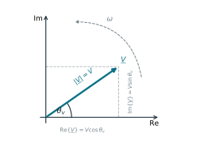
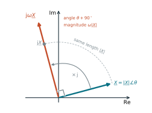
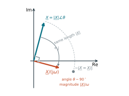
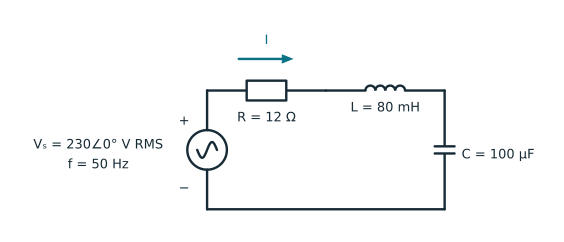
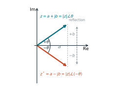

## What you will learn

After working through this tutorial, you should be able to:

- move between rectangular, polar, and exponential forms of a complex number;
- explain how a phasor represents a sinusoid at one fixed frequency;
- use complex impedances for resistors, inductors, and capacitors;
- solve a sinusoidal steady-state circuit with complex Ohm's law;
- calculate active, reactive, and apparent power with a consistent sign convention; and
- recognise when a phasor model is not appropriate.

## 1. Why AC calculations use complex numbers

To solve a circuit, we combine the voltage--current law of each component with Kirchhoff's current law at nodes and Kirchhoff's voltage law around loops. The component laws describe the individual resistors, inductors, and capacitors; Kirchhoff's laws connect them into a system of equations for the unknown voltages and currents.

In sinusoidal steady state, the voltages in a Kirchhoff voltage-law equation have the same angular frequency $\omega$ but can have different amplitudes and phases. Consider two of them:

$$
v_1(t)=\sqrt{2}V_1\cos(\omega t+\theta_1),
\qquad
v_2(t)=\sqrt{2}V_2\cos(\omega t+\theta_2).
$$ {#eq-ac-waveforms}

Here $V_1$ and $V_2$ are root-mean-square (RMS) values. Kirchhoff's voltage law adds the instantaneous waveforms $v_1(t)$ and $v_2(t)$, but their RMS amplitudes cannot simply be added because their phases differ. In the time domain, their sum must first be expanded into common cosine and sine components:

$$
\begin{aligned}
v_1(t)+v_2(t)
={}&\sqrt{2}\big[(V_1\cos\theta_1+V_2\cos\theta_2)\cos\omega t\\
&\quad -(V_1\sin\theta_1+V_2\sin\theta_2)\sin\omega t\big].
\end{aligned}
$$

Define the cosine and sine coefficients as

$$
C=V_1\cos\theta_1+V_2\cos\theta_2,
\qquad
D=V_1\sin\theta_1+V_2\sin\theta_2.
$$

To recombine them, compare $C\cos\omega t-D\sin\omega t$ with the angle-addition identity

$$
V_\Sigma\cos(\omega t+\theta_\Sigma)
=V_\Sigma\cos\theta_\Sigma\cos\omega t
-V_\Sigma\sin\theta_\Sigma\sin\omega t.
$$

Matching coefficients gives

$$
V_\Sigma=\sqrt{C^2+D^2},
\qquad
\theta_\Sigma=\operatorname{atan2}(D,C),
$$

and therefore

$$
v_1(t)+v_2(t)
=\sqrt{2}V_\Sigma\cos(\omega t+\theta_\Sigma).
$$

Thus even one addition requires expansion, coefficient addition, a square root, and an inverse trigonometric function. Kirchhoff's current law creates the same problem when it adds currents with different phases. Inductor and capacitor equations also introduce derivatives or integrals, increasing the complexity of AC calculations in the time domain.

To solve this problem, complex numbers are introduced to represent the electrical quantities.

In electrical engineering we use $\mathrm{j}$ for the imaginary unit because $i$ is normally reserved for current:

$$
\mathrm{j}^2=-1.
$$

A complex number $z$ can be written in three equivalent forms:

$$
\begin{aligned}
z &= a+\mathrm{j}b && \text{rectangular form},\\
  &= |z|\angle\theta && \text{polar form},\\
  &= |z|e^{\mathrm{j}\theta} && \text{exponential form},
\end{aligned}
$$ {#eq-complex-forms}

where

$$
|z|=\sqrt{a^2+b^2},
\qquad
\theta=\operatorname{atan2}(b,a).
$$ {#eq-magnitude-angle}

::: {.callout-tip title="Why use atan2 instead of arctan?"}
The ratio $b/a$ gives the slope but loses the separate signs of $a$ and $b$, so it cannot determine the quadrant and is undefined when $a=0$. For example, $z=-1+\mathrm{j}$ lies in quadrant II, but $\arctan(1/-1)=-45^\circ$ gives a quadrant-IV angle. Using both coordinates, $\operatorname{atan2}(1,-1)=135^\circ$ returns the correct angle and also handles points on the imaginary axis. Only $z=0$ has no defined angle.
:::

Substituting Euler's identity into the exponential form connects the polar and rectangular descriptions:

$$
z=|z|e^{\mathrm{j}\theta}=|z| (\cos\theta+\mathrm{j}\sin\theta)=a+\mathrm{j}b,
$$

Comparing real and imaginary parts shows that the rectangular components are $a=|z|\cos\theta$ and $b=|z|\sin\theta$. These forms describe the same complex number, but each exposes different information.

The most convenient form therefore depends on the operation. Rectangular form separates the real and imaginary components, which can be added or subtracted independently. Polar form separates magnitude and angle, so multiplication and division reduce to multiplying or dividing magnitudes and adding or subtracting angles. Consequently, use rectangular form for addition and subtraction, and polar form for multiplication and division:

$$
\begin{aligned}
(a+\mathrm{j}b)+(c+\mathrm{j}d)
  &= (a+c)+\mathrm{j}(b+d),\\
(r_1\angle\theta_1)(r_2\angle\theta_2)
  &= r_1r_2\angle(\theta_1+\theta_2),\\
\frac{r_1\angle\theta_1}{r_2\angle\theta_2}
  &= \frac{r_1}{r_2}\angle(\theta_1-\theta_2).
\end{aligned}
$$ {#eq-complex-arithmetic}

::: {.callout-tip}
Angles in equations may be shown in degrees for intuition, but NumPy's trigonometric and exponential functions expect radians. Convert explicitly with `np.deg2rad` and `np.rad2deg`.
:::

## 2. From a sinusoid to a phasor

A sinusoid is characterised by its frequency, magnitude, and phase. In a sinusoidal steady-state circuit, all voltages and currents have the same known frequency, so only their magnitudes and phases differ. A **phasor** is a complex number that records the magnitude and the phase. Geometrically, it is a fixed arrow in the complex plane: its length represents the sinusoid's RMS magnitude, and its angle represents the phase. The phasor itself does not vary with time. The common rotation at angular frequency $\omega$ is omitted.

This geometric interpretation is shown in @fig-phasor-geometry. The dashed projections are the real and imaginary components of the same complex number; they are not additional phasors. The curved arrow indicates the angular frequency $\omega$ of the time-dependent rotation that the phasor omits.

{#fig-phasor-geometry fig-align="center" width="62%"}

Before constructing a phasor, we must specify how its phase is measured. A sinusoid can be written using either cosine or sine, and the numerical phase angle changes with that choice. This tutorial uses cosine as the reference:

$$
v(t)=\sqrt{2}V\cos(\omega t+\theta_v).
$$

Here $V$ is the RMS magnitude, so $\sqrt{2}V$ is the peak magnitude, and $\theta_v$ is the phase measured relative to a cosine. This is what a **cosine-based RMS phasor** means.

Euler's identity gives $\Re\{e^{\mathrm{j}x}\}=\cos x$, allowing the same waveform to be written as the real part of a rotating complex exponential:

$$
v(t)
=\sqrt{2}\,\Re\!\left\{V e^{\mathrm{j}\theta_v}e^{\mathrm{j}\omega t}\right\}.
$$ {#eq-sinusoid-complex-exponential}

In a linear circuit operating in sinusoidal steady state at frequency $\omega$, the complex-exponential representation of every voltage and current contains the same factor $e^{\mathrm{j}\omega t}$. Omitting this common time-dependent factor gives the commonly used notation for a phasor:

$$
\underline V=V e^{\mathrm{j}\theta_v}=V\angle\theta_v.
$$ {#eq-voltage-phasor}

This tutorial marks phasors with an underline in equations. To reconstruct the waveform, restore $e^{\mathrm{j}\omega t}$, take the real part, and convert the RMS magnitude to a peak magnitude:

$$
\begin{aligned}
v(t)
&=\sqrt{2}\,\Re\!\left\{\underline V e^{\mathrm{j}\omega t}\right\}\\
&=\sqrt{2}V\cos(\omega t+\theta_v).
\end{aligned}
$$ {#eq-phasor-to-time}

For example, $\underline V=230\angle 30^\circ\ \mathrm{V}$ represents

$$
v(t)=\sqrt{2}(230)\cos(\omega t+30^\circ)\ \mathrm{V}.
$$

Its RMS magnitude is $230\ \mathrm{V}$, its peak magnitude is $\sqrt{2}(230)\ \mathrm{V}$, and its cosine phase is $30^\circ$.

::: {.callout-warning title="Keep the convention consistent"}
Neither a cosine nor a sine reference is inherently more correct. The example waveform can also be written as a sine because $\cos x=\sin(x+90^\circ)$, but its sine-referenced phase would be $120^\circ$, not $30^\circ$. Do not mix these references within one calculation. Likewise, do not mix peak and RMS phasors: every voltage and current phasor must use the same reference and scale conventions. This tutorial uses cosine-based RMS phasors throughout.
:::

### 2.1 Why derivatives become multiplication by $\mathrm{j}\omega$ {#sec-phasor-differentiation}

Consider a sinusoid represented by its RMS phasor $\underline X$:

$$
x(t)=\sqrt{2}\,\Re\!\left\{\underline X e^{\mathrm{j}\omega t}\right\}.
$$

Differentiation of $x(t)$ gives:

$$
\begin{aligned}
\frac{\mathrm d x(t)}{\mathrm dt}
&=\sqrt{2}\,\Re\!\left\{
\underline X\frac{\mathrm d}{\mathrm dt}e^{\mathrm{j}\omega t}
\right\} \\
&=\sqrt{2}\,\Re\!\left\{
(\mathrm{j}\omega\underline X)e^{\mathrm{j}\omega t}
\right\}.
\end{aligned}
$$

Therefore, the time-domain derivative is represented by the phasor $\mathrm{j}\omega\underline X$:

$$
\frac{\mathrm d x(t)}{\mathrm dt}
\quad\longleftrightarrow\quad
\mathrm{j}\omega\underline X.
$$ {#eq-phasor-derivative}

The factor $\omega$ multiplies the RMS magnitude, while $\mathrm{j}=e^{\mathrm{j}\pi/2}$ advances the phase by $90^\circ$. @fig-phasor-derivative-phase-advance separates these two effects geometrically. First, multiplication by $\mathrm{j}$ rotates $\underline X$ counterclockwise by $90^\circ$ without changing its magnitude. Multiplication by the positive scalar $\omega$ then changes only the length, producing $\mathrm{j}\omega\underline X$. The derivative remains a sinusoid at the same frequency, so it can be represented within the same phasor model.

{#fig-phasor-derivative-phase-advance fig-align="center" width="70%"}

This rule is related to, but more restricted than, the Laplace derivative rule

$$
\mathcal L\!\left\{\frac{\mathrm d x}{\mathrm dt}\right\}
=sX(s)-x(0^-).
$$

With zero initial conditions, differentiation becomes multiplication by $s$ in the Laplace domain. Evaluating a linear circuit's Laplace-domain relation on the imaginary axis, $s=\mathrm{j}\omega$, gives the sinusoidal steady-state phasor rule. The full Laplace method can retain initial conditions and transient behavior; the phasor method describes one frequency after those transients have disappeared.

This differentiation property produces the familiar inductor and capacitor impedances.

### 2.2 Why integrals become division by $\mathrm{j}\omega$ {#sec-phasor-integration}

Again consider a sinusoid represented by its RMS phasor $\underline X$:

$$
x(t)=\sqrt{2}\,\Re\!\left\{\underline X e^{\mathrm{j}\omega t}\right\}.
$$

For $\omega\neq 0$, integrating its complex representation gives the sinusoidal part of an antiderivative:

$$
\begin{aligned}
y_{\mathrm{ac}}(t)
&=\sqrt{2}\,\Re\!\left\{
\underline X\int e^{\mathrm{j}\omega t}\,\mathrm dt
\right\} \\
&=\sqrt{2}\,\Re\!\left\{
\left(\frac{\underline X}{\mathrm{j}\omega}\right)
e^{\mathrm{j}\omega t}
\right\}.
\end{aligned}
$$

Therefore, time-domain integration is represented by division of the phasor by $\mathrm{j}\omega$:

$$
\int x(t)\,\mathrm dt
\quad\longleftrightarrow\quad
\frac{\underline X}{\mathrm{j}\omega}.
$$ {#eq-phasor-integral}

Because $1/\mathrm{j}=-\mathrm{j}=e^{-\mathrm{j}\pi/2}$, integration divides the RMS magnitude by $\omega$ and delays the phase by $90^\circ$. @fig-phasor-integral-phase-delay separates these effects geometrically. Division by $\mathrm{j}$ first rotates $\underline X$ clockwise by $90^\circ$ without changing its magnitude. Division by the positive scalar $\omega$ then changes only the length, producing $\underline X/(\mathrm{j}\omega)$.

{#fig-phasor-integral-phase-delay fig-align="center" width="70%"}

An indefinite integral also contains an arbitrary constant:

$$
y(t)=y_{\mathrm{ac}}(t)+K.
$$

The constant $K$ is a zero-frequency, or DC, component and is not part of the phasor at the nonzero frequency $\omega$. This is why the phasor rule describes the sinusoidal component but does not determine an initial condition.

The corresponding Laplace-domain relation makes this distinction explicit. If $\mathrm dy/\mathrm dt=x$, then

$$
Y(s)=\frac{X(s)}{s}+\frac{y(0^-)}{s}.
$$

The term $y(0^-)/s$ carries the initial condition. Dropping the transient and DC contributions and evaluating the sinusoidal response at $s=\mathrm{j}\omega$ leaves $\underline Y=\underline X/(\mathrm{j}\omega)$.

## 3. Impedance: Ohm's law for phasors

In sinusoidal steady state, voltage and current phasors obey complex Ohm's law [@grainger1994]:

$$
\underline V=\underline Z\,\underline I,
\qquad
\underline I=\frac{\underline V}{\underline Z}.
$$ {#eq-complex-ohm}

At angular frequency $\omega=2\pi f$, the ideal element impedances are

| Element | Time-domain relation | Impedance | Phase effect |
|---|---|---|---|
| Resistor $R$ | $v=Ri$ | $Z_R=R$ | voltage and current are in phase |
| Inductor $L$ | $v=L\,\mathrm di/\mathrm dt$ | $Z_L=\mathrm{j}\omega L$ | voltage leads current by $90^\circ$ |
| Capacitor $C$ | $i=C\,\mathrm dv/\mathrm dt$ | $Z_C=1/(\mathrm{j}\omega C)=-\mathrm{j}/(\omega C)$ | current leads voltage by $90^\circ$ |

: Ideal R, L, and C impedance models {#tbl-rlc-impedances}

An impedance is commonly split into resistance and reactance:

$$
\underline Z=R+\mathrm{j}X.
$$ {#eq-resistance-reactance}

Positive reactance is inductive; negative reactance is capacitive. Series impedances add because their current is common:

$$
\underline Z_{\mathrm{series}}
=\underline Z_1+\underline Z_2+\cdots.
$$

For parallel branches it is often easier to use admittance,

$$
\underline Y=\frac{1}{\underline Z}=G+\mathrm{j}B,
$$

because parallel admittances add. $G$ is conductance and $B$ is susceptance.

::: {.callout-note}
The symbols $R$, $L$, and $C$ are determined by the physical component, regardless of the frequency. Impedance is frequency dependent: changing $f$ changes $Z_L$ and $Z_C$, even though $L$ and $C$ themselves stay fixed in this ideal model.
:::

## 4. Worked series RLC circuit

In this example, we will represent the resistor, inductor, and capacitor with their complex impedances. With the complex values, we find series current, calculate each element's voltage drop, and verify Kirchhoff's voltage law. The purpose is to show how phasors turn a sinusoidal time-domain problem into complex algebra while retaining the magnitudes and phase relationships of the physical waveforms.

Consider a $230\ \mathrm{V}$ RMS, $50\ \mathrm{Hz}$ voltage source and a series RLC circuit with

$$
R=12\ \Omega,
\qquad
L=80\ \mathrm{mH},
\qquad
C=100\ \mu\mathrm{F}.
$$

The circuit topology and the clockwise reference direction for the common series current are shown in @fig-series-rlc-ac-circuit.

{#fig-series-rlc-ac-circuit fig-align="center" width="82%"}

Take the source as the angular reference, $\underline V_s=230\angle0^\circ\ \mathrm{V}$. At $f=50\ \mathrm{Hz}$, the angular frequency is

$$
\omega=2\pi f=2\pi(50)=314.159\ \mathrm{rad/s}.
$$

The three component impedances are therefore

$$
\begin{aligned}
\underline Z_R &= R
  = 12\ \Omega,\\
\underline Z_L &= \mathrm{j}\omega L
  = \mathrm{j}(314.159)(0.080)
  = \mathrm{j}25.133\ \Omega,\\
\underline Z_C &= \frac{1}{\mathrm{j}\omega C}
  = \frac{1}{\mathrm{j}(314.159)(100\times10^{-6})}
  = -\mathrm{j}31.831\ \Omega.
\end{aligned}
$$ {#eq-series-rlc-component-impedances}

Series impedances add, giving

$$
\begin{aligned}
\underline Z
&=R+\mathrm{j}\omega L+\frac{1}{\mathrm{j}\omega C}\\
&=R+\mathrm{j}\left(\omega L-\frac{1}{\omega C}\right)\\
&=12-\mathrm{j}6.698\ \Omega
 =13.743\angle-29.17^\circ\ \Omega.
\end{aligned}
$$ {#eq-series-rlc-impedance}

The resistance is the real part and the net reactance is the imaginary part. Applying complex Ohm's law gives the common series current:

$$
\begin{aligned}
\underline I
&=\frac{\underline V_s}{\underline Z}
 =\frac{230\angle0^\circ}{13.743\angle-29.17^\circ}\\
&=16.736\angle29.17^\circ\ \mathrm{A}
 =14.613+\mathrm{j}8.157\ \mathrm{A}.
\end{aligned}
$$ {#eq-series-rlc-current}

The same current flows through every element, so each voltage drop follows from $\underline V_k=\underline I\underline Z_k$:

$$
\begin{aligned}
\underline V_R
  &=\underline I\underline Z_R
   =200.831\angle29.17^\circ\ \mathrm{V}
   =175.362+\mathrm{j}97.885\ \mathrm{V},\\
\underline V_L
  &=\underline I\underline Z_L
   =420.620\angle119.17^\circ\ \mathrm{V}
   =-205.009+\mathrm{j}367.277\ \mathrm{V},\\
\underline V_C
  &=\underline I\underline Z_C
   =532.722\angle-60.83^\circ\ \mathrm{V}
   =259.648-\mathrm{j}465.162\ \mathrm{V}.
\end{aligned}
$$ {#eq-series-rlc-voltage-drops}

In exact arithmetic, these voltage phasors satisfy Kirchhoff's voltage law:

$$
\begin{aligned}
\underline V_R+\underline V_L+\underline V_C
&=\underline I(\underline Z_R+\underline Z_L+\underline Z_C)\\
&=\underline I\underline Z
 =\underline V_s.
\end{aligned}
$$ {#eq-rlc-kvl}

The Python calculation below follows this same sequence and prints each result in rectangular and polar form. Its final residual measures the small floating-point error in @eq-rlc-kvl.

```{python}
#| label: lst-complex-rlc-solution
#| lst-cap: "Solve a series RLC circuit with complex arithmetic"
#| code-summary: "Calculate the impedance, current, and element voltages"

import numpy as np


def polar(magnitude: float, angle_deg: float = 0.0) -> complex:
    """Create a complex number from magnitude and angle in degrees."""
    return magnitude * np.exp(1j * np.deg2rad(angle_deg))


def describe(name: str, value: complex, unit: str) -> None:
    """Print rectangular and polar representations of a phasor."""
    print(
        f"{name:>3} = {value.real:+9.3f} {value.imag:+9.3f}j {unit}"
        f"  = {abs(value):8.3f} ∠ {np.rad2deg(np.angle(value)):+7.2f}° {unit}"
    )


frequency = 50.0  # Hz
resistance = 12.0  # ohm
inductance = 80e-3  # H
capacitance = 100e-6  # F
source_voltage = polar(230.0, 0.0)  # V RMS

omega = 2.0 * np.pi * frequency
z_r = resistance + 0j
z_l = 1j * omega * inductance
z_c = 1.0 / (1j * omega * capacitance)
z_total = z_r + z_l + z_c
current = source_voltage / z_total

v_r = current * z_r
v_l = current * z_l
v_c = current * z_c

for label, phasor, unit in [
    ("Z", z_total, "Ω"),
    ("I", current, "A"),
    ("VR", v_r, "V"),
    ("VL", v_l, "V"),
    ("VC", v_c, "V"),
]:
    describe(label, phasor, unit)

voltage_residual = source_voltage - (v_r + v_l + v_c)
print(f"\nKVL residual magnitude = {abs(voltage_residual):.3e} V")
```

::: {.callout-note title="Exercise: explore frequency dependence"}
1. Set `frequency = 40.0`. Before running the code, predict whether the circuit is net capacitive or inductive and whether the current leads or lags the source voltage.
2. Run the calculation and check your prediction against the sign of $\operatorname{Im}(\underline Z)$ and the angle of $\underline I$.
3. Repeat the prediction and calculation for `frequency = 80.0`.
4. Explain the change between the two cases using $X_L=\omega L$ and $X_C=-1/(\omega C)$.
:::

## 5. Complex power and the conjugate

Complex power is the first calculation in this tutorial that requires the complex conjugate. For $z=a+\mathrm{j}b$, its conjugate is $z^*=a-\mathrm{j}b$: geometrically, this reflects $z$ across the real axis and reverses the sign of its angle, as shown in @fig-complex-conjugate-geometry.

::: {#fig-complex-conjugate-geometry}
{fig-alt="A complex number and its conjugate reflected across the real axis, with equal magnitudes and opposite angles and imaginary components." fig-align="center" width="64%"}

The conjugate $z^*$ is the reflection of $z$ across the real axis. The two numbers have the same magnitude and real component, while their angles and imaginary components have opposite signs.
:::

Both numbers have magnitude $|z|$, while their angles are $\theta$ and $-\theta$. Their product therefore has magnitude $|z|^2$ and zero angle:

$$
zz^*
=\left(|z|\angle\theta\right)
 \left(|z|\angle(-\theta)\right)
=|z|^2\angle0
=|z|^2.
$$

Adopt the [passive sign convention](https://en.wikipedia.org/wiki/Passive_sign_convention): current enters the terminal marked with positive voltage. To see why power uses the conjugate of the current phasor, begin with the corresponding time-domain waveforms:

$$
v(t)=\sqrt{2}V\cos(\omega t+\theta_v),
\qquad
i(t)=\sqrt{2}I\cos(\omega t+\theta_i).
$$

Their instantaneous product is

$$
\begin{aligned}
p(t)=v(t)i(t)
&=2VI\cos(\omega t+\theta_v)\cos(\omega t+\theta_i)\\
&=VI\cos(\theta_v-\theta_i)
  +VI\cos(2\omega t+\theta_v+\theta_i).
\end{aligned}
$$

::: {.callout-tip title="Product-to-sum formula"}
The second line follows from

$$
2\cos A\cos B=\cos(A-B)+\cos(A+B),
$$

with $A=\omega t+\theta_v$ and $B=\omega t+\theta_i$. Therefore,

$$
A-B=\theta_v-\theta_i,
\qquad
A+B=2\omega t+\theta_v+\theta_i.
$$
:::

The second term averages to zero over one cycle. Therefore, the average power is

$$
P=VI\cos(\theta_v-\theta_i).
$$

Physical power thus depends on the **phase difference** between voltage and current. Complex power is defined to preserve this difference while also recording the quadrature component. Because conjugation reverses the current angle,

$$
\begin{aligned}
\underline S
=\underline V\underline I^*
&=(V\angle\theta_v)(I\angle(-\theta_i))\\
&=VI\angle(\theta_v-\theta_i)
=P+\mathrm{j}Q.
\end{aligned}
$$ {#eq-complex-power-basics}

Its components are

| Quantity | Definition | Unit | Interpretation |
|---|---|---|---|
| Active power | $P=\Re\{\underline S\}$ | watt (W) | average energy conversion or dissipation |
| Reactive power | $Q=\Im\{\underline S\}$ | var | oscillatory energy exchange with fields |
| Apparent power | $|\underline S|=|\underline V||\underline I|$ | volt-ampere (VA) | RMS voltage-current loading |
| Power factor | $\mathrm{pf}=P/|\underline S|$ | dimensionless | utilisation of apparent power |

: Quantities derived from complex power {#tbl-complex-power-quantities}

If $\phi=\theta_v-\theta_i$ is the voltage angle minus the current angle, the rectangular components of this product are

$$
\underline S=VI\angle\phi,
\qquad
P=VI\cos\phi,
\qquad
Q=VI\sin\phi.
$$ {#eq-power-angle}

By contrast, $\underline V\underline I=VI\angle(\theta_v+\theta_i)$ would add the angles. That sum changes if the time reference is shifted, even though the physical relationship between voltage and current does not. It therefore cannot represent power; the conjugated product can because the phase difference is independent of the chosen reference.

Under the [passive sign convention](https://en.wikipedia.org/wiki/Passive_sign_convention), an inductive load has lagging current and $Q>0$; a capacitive load has leading current and $Q<0$. Apply @eq-complex-power-basics to the worked circuit:

```{python}
#| label: lst-complex-rlc-power
#| lst-cap: "Calculate and reconcile complex power"
#| code-summary: "Calculate active, reactive, and apparent power"

s_source_delivered = source_voltage * current.conjugate()
s_r = v_r * current.conjugate()
s_l = v_l * current.conjugate()
s_c = v_c * current.conjugate()
s_elements = s_r + s_l + s_c

active_power = s_source_delivered.real
reactive_power = s_source_delivered.imag
apparent_power = abs(s_source_delivered)
power_factor = active_power / apparent_power
power_factor_type = "lagging" if reactive_power > 0 else "leading"

print(f"S = {active_power:.2f} {reactive_power:+.2f}j VA")
print(f"P = {active_power:.2f} W")
print(f"Q = {reactive_power:.2f} var")
print(f"|S| = {apparent_power:.2f} VA")
print(f"power factor = {power_factor:.4f} {power_factor_type}")

print("\nComponent complex powers:")
for label, complex_power in [("R", s_r), ("L", s_l), ("C", s_c)]:
    component_p = 0.0 if abs(complex_power.real) < 5e-3 else complex_power.real
    component_q = 0.0 if abs(complex_power.imag) < 5e-3 else complex_power.imag
    print(
        f"S_{label} = {component_p:.2f} {component_q:+.2f}j VA  "
        f"(P = {component_p:.2f} W, Q = {component_q:+.2f} var)"
    )

print(f"power-balance residual = {abs(s_source_delivered - s_elements):.3e} VA")
```

Only the ideal resistor absorbs active power. The ideal inductor and capacitor have zero active power.

::: {.callout-important}
Power signs depend on the chosen current direction. @Eq-complex-power-basics describes **absorbed** power when current enters the positive-voltage terminal. If current is instead defined as leaving that terminal, insert a minus sign or reinterpret positive power as injection. The signs should be consistent throughout all calculations to avoid mistakes.
:::

## 6. Frequency changes the circuit

The series circuit resonates when its inductive and capacitive reactances cancel:

$$
\omega_0L=\frac{1}{\omega_0C},
\qquad
f_0=\frac{1}{2\pi\sqrt{LC}}.
$$ {#eq-series-resonance}

At $f_0$, the ideal series impedance is purely resistive, the current is in phase with the source, and its magnitude reaches $V/R$. Below resonance frequency the circuit is net capacitive and above resonance frequency it is net inductive.

```{python}
#| label: lst-complex-frequency-sweep
#| lst-cap: "Inspect the frequency dependence of a series RLC circuit"
#| code-summary: "Sweep frequency around series resonance"

resonant_frequency = 1.0 / (2.0 * np.pi * np.sqrt(inductance * capacitance))
frequencies = np.array([25.0, 40.0, 50.0, resonant_frequency, 75.0, 100.0])

print(f"resonant frequency = {resonant_frequency:.3f} Hz\n")
print(" f (Hz)   |Z| (Ω)   ∠Z (deg)   |I| (A)   behaviour")
for f in frequencies:
    angular_frequency = 2.0 * np.pi * f
    impedance = resistance + 1j * (
        angular_frequency * inductance
        - 1.0 / (angular_frequency * capacitance)
    )
    branch_current = source_voltage / impedance
    if np.isclose(impedance.imag, 0.0, atol=1e-10):
        behaviour = "resistive"
    elif impedance.imag > 0.0:
        behaviour = "inductive"
    else:
        behaviour = "capacitive"
    print(
        f"{f:7.3f}  {abs(impedance):8.3f}"
        f"  {np.rad2deg(np.angle(impedance)):10.3f}"
        f"  {abs(branch_current):8.3f}   {behaviour}"
    )
```

This section is a reminder that a phasor solution belongs to one frequency. Each row represents a different steady-state problem.

## 7. Common mistakes

### Adding magnitudes instead of phasors

Kirchhoff's laws apply to complex phasors. Add $\underline V_1+\underline V_2$, not $|\underline V_1|+|\underline V_2|$, unless the phasors happen to have the same angle.

### Confusing $\mathrm{j}$ with a unit label

In `12 - 6.7j`, `j` is part of the number. The unit $\Omega$ belongs to the complete complex impedance, not only to its real part.

### Losing the quadrant of an angle

Use a two-argument angle function such as $\operatorname{atan2}(b,a)$ or `np.angle(z)`. Computing $\arctan(b/a)$ alone cannot distinguish all four quadrants and fails when $a=0$.

### Forgetting the power conjugate

For RMS phasors under the [passive sign convention](https://en.wikipedia.org/wiki/Passive_sign_convention), use $\underline S=\underline V\underline I^*$. The unconjugated product has the wrong phase angle.

### Applying phasors outside their assumptions

The impedance method used here assumes a linear circuit in sinusoidal steady state at a single frequency. If a linear circuit is excited at several frequencies, each frequency component can be analysed separately using its own phasor and frequency-dependent impedance; the resulting time-domain responses are then added. This procedure, called superposition, does not apply directly to nonlinear devices or saturation. Switching transients require a time-domain treatment.

## 8. Takeaways

- A phasor stores a sinusoid's RMS magnitude and phase while suppressing the common rotation factor $e^{\mathrm{j}\omega t}$.
- Rectangular form of complex numbers simplifies addition; polar form simplifies multiplication and division.
- Differentiation and integration become multiplication and division by $\mathrm{j}\omega$.
- Impedance converts RLC differential relations into algebraic equations, and Kirchhoff's laws apply to the complex phasors.
- Under the [passive sign convention](https://en.wikipedia.org/wiki/Passive_sign_convention), $\underline S=\underline V\underline I^*=P+\mathrm{j}Q$, and component powers add to the total.
- A phasor solution applies to one frequency. Linear multi-frequency responses can be superposed. Transients and nonlinear circuits require time-domain analysis.

The same ideas scale from one circuit to an entire power network. The [Y-bus matrix tutorial](y-bus-matrix.qmd) assembles complex branch admittances into a network equation, and the [Newton--Raphson power-flow tutorial](newton-raphson-power-flow.qmd) uses complex bus voltages to calculate active and reactive power.

## References {.unnumbered}

::: {#refs}
:::
