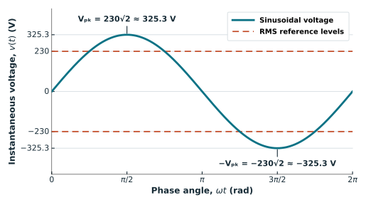

## What you will learn

After working through this tutorial, you should be able to:

- derive the RMS definition from the equivalent-heating effect of a DC voltage on an ideal resistor;
- derive $V_{\mathrm{rms}}=V_{\mathrm{pk}}/\sqrt{2}$ for a sinusoid;
- convert between the nominal RMS and peak voltages of sinusoidal household supplies;
- compare the RMS values of sinusoidal, square, triangular, and rectified waveforms;
- combine DC and zero-mean AC components using their mean-square contributions;
- calculate RMS from uniformly sampled data and explain why the observation-window duration matters; and
- distinguish RMS voltage and current from active power in a general AC circuit.

## Prerequisites

Only basic algebra, integration, and sinusoidal waveforms are required. 

## 1. Effective value means equivalent heating in a resistor

Apply a periodic voltage $v(t)$ with period $T$ to an ideal resistor $R$. Its instantaneous power is

$$
p(t)=\frac{v^2(t)}{R}.
$$

The average power over one period is

$$
P
=\frac{1}{T}\int_{t_0}^{t_0+T}\frac{v^2(t)}{R}\,\mathrm dt.
$$ {#eq-rms-resistor-average-power}

::: {.callout-important title="Definition: Effective Value"}
The **effective value** of a periodic AC voltage or current is the constant DC value that would produce the **same average power—and therefore the same heating—in an ideal resistor**.

Because we define the effective value with an ideal resistor, the effective value is also called the **root mean square (RMS) value**.
:::

Equating the resistor power produced by $V_{\mathrm{rms}}$ with @eq-rms-resistor-average-power gives

$$
\frac{V_{\mathrm{rms}}^2}{R}
=\frac{1}{T}\int_{t_0}^{t_0+T}\frac{v^2(t)}{R}\,\mathrm dt.
$$

Cancelling the resistance gives the RMS voltage:

$$
V_{\mathrm{rms}}
=\sqrt{\frac{1}{T}\int_{t_0}^{t_0+T}v^2(t)\,\mathrm dt}.
$$ {#eq-rms-periodic-voltage}

RMS literally means square the waveform, take its mean, and then take the nonnegative square root. The same definition applies to current and to any other electrical quantity $x(t)$ in power system analysis:

$$
X_{\mathrm{rms}}
=\sqrt{\frac{1}{T}\int_{t_0}^{t_0+T}x^2(t)\,\mathrm dt}.
$$ {#eq-rms-general-periodic}

For an ideal resistor, combining the average-power expression with the RMS definition gives

$$
P=\frac{V_{\mathrm{rms}}^2}{R}
=I_{\mathrm{rms}}^2R.
$$ {#eq-rms-resistor-power}

## 2. RMS of a sinusoid

Let

$$
v(t)=V_{\mathrm{pk}}\cos(\omega t+\theta).
$$ {#eq-rms-peak-sinusoid}


Start with the squared RMS definition, substitute $v(t)=V_{\mathrm{pk}}\cos(\omega t+\theta)$, and then apply the half-angle formula:

$$
\begin{aligned}
V_{\mathrm{rms}}^2
&=\frac{1}{T}\int_{t_0}^{t_0+T}v^2(t)\,\mathrm dt\\
&=\frac{V_{\mathrm{pk}}^2}{T}\int_{t_0}^{t_0+T}
\cos^2(\omega t+\theta)\,\mathrm dt\\
&=\frac{V_{\mathrm{pk}}^2}{T}\int_{t_0}^{t_0+T}
\frac{1+\cos\!\left(2(\omega t+\theta)\right)}{2}\,\mathrm dt\\
&=\frac{V_{\mathrm{pk}}^2}{2T}\int_{t_0}^{t_0+T}
\left[1+\cos(2\omega t+2\theta)\right]\,\mathrm dt.
\end{aligned}
$$

Using the linearity of integration to split the two terms gives

$$
V_{\mathrm{rms}}^2
=\frac{V_{\mathrm{pk}}^2}{2T}
\left[
\int_{t_0}^{t_0+T}1\,\mathrm dt
+\int_{t_0}^{t_0+T}\cos(2\omega t+2\theta)\,\mathrm dt
\right].
$$ {#eq-rms-sinusoid-split-integrals}

::: {.callout-note title="Half-Angle Formula"}
$$
\cos^2\alpha=\frac{1+\cos(2\alpha)}{2}.
$$
:::

Of the two integral terms in @eq-rms-sinusoid-split-integrals, evaluate the second using the Fundamental Theorem of Calculus:

$$
\begin{aligned}
\int_{t_0}^{t_0+T}\cos(2\omega t+2\theta)\,\mathrm dt
&=\left[\frac{\sin(2\omega t+2\theta)}{2\omega}\right]_{t_0}^{t_0+T}\\
&=\frac{\sin(2\omega t_0+2\theta+4\pi)
-\sin(2\omega t_0+2\theta)}{2\omega}\\
&=\frac{\sin(2\omega t_0+2\theta)
-\sin(2\omega t_0+2\theta)}{2\omega}\\
&=0.
\end{aligned}
$$

::: {.callout-note title="Fundamental Theorem of Calculus"}
To evaluate a definite integral, use the **Fundamental Theorem of Calculus**, also called the **Newton--Leibniz formula**. If $F'(t)=f(t)$, then

$$
\int_a^b f(t)\,\mathrm dt
=F(b)-F(a)
=\left[F(t)\right]_a^b.
$$
:::

The first integral term in @eq-rms-sinusoid-split-integrals is simply $T$. Combining this result with the zero value of the second integral gives

$$
V_{\mathrm{rms}}^2
=\frac{V_{\mathrm{pk}}^2}{2T}T
=\frac{V_{\mathrm{pk}}^2}{2}.
$$

Taking the nonnegative square root gives

$$
V_{\mathrm{rms}}=\frac{V_{\mathrm{pk}}}{\sqrt{2}}.
$$ {#eq-rms-sine-result}

The result does not depend on phase $\theta$. A $230\ \mathrm{V}$ RMS sinusoid has a peak magnitude of

$$
V_{\mathrm{pk}}=\sqrt{2}(230)\approx325.27\ \mathrm{V}.
$$

::: {.callout-tip title="Nominal Household RMS Voltages"}
The voltage stated for an AC supply is normally its **nominal RMS voltage**, not its peak voltage. For an ideal sinusoidal supply, the corresponding peak is $V_{\mathrm{pk}}=\sqrt{2}V_{\mathrm{rms}}$.

| Country | Common household supply | Frequency | Corresponding sinusoidal peak |
|---|---:|---:|---:|
| Netherlands | $230\ \mathrm{V}$ line-to-neutral | $50\ \mathrm{Hz}$ | $230\sqrt{2}\approx325.3\ \mathrm{V}$ |
| Germany | $230\ \mathrm{V}$ line-to-neutral | $50\ \mathrm{Hz}$ | $230\sqrt{2}\approx325.3\ \mathrm{V}$ |
| China (mainland) | $220\ \mathrm{V}$ line-to-neutral | $50\ \mathrm{Hz}$ | $220\sqrt{2}\approx311.1\ \mathrm{V}$ |
| United States | $120\ \mathrm{V}$ line-to-neutral | $60\ \mathrm{Hz}$ | $120\sqrt{2}\approx169.7\ \mathrm{V}$ |
| United States | $240\ \mathrm{V}$ line-to-line | $60\ \mathrm{Hz}$ | $240\sqrt{2}\approx339.4\ \mathrm{V}$ |

The two U.S. entries describe the common $120/240\ \mathrm{V}$ split-phase residential service: ordinary receptacles are generally connected line-to-neutral, whereas many high-power appliances are connected line-to-line. These are nominal values; the measured voltage at an outlet varies with supply tolerances and operating conditions.

Sources: [EU mains definition](https://eur-lex.europa.eu/legal-content/EN/TXT/?uri=CELEX:02019R2023-20210501), China national standard [GB/T 156-2017, *Standard Voltages*](https://std.samr.gov.cn/gb/search/gbDetailed?id=71F772D82246D3A7E05397BE0A0AB82A), and [U.S. National Institute of Standards and Technology](https://nvlpubs.nist.gov/nistpubs/TechnicalNotes/NIST.TN.2249.pdf).
:::

The voltage scales are shown to scale in @fig-rms-voltage-scale.

::: {#fig-rms-voltage-scale}
{fig-alt="One period of a 230 volt RMS sinusoid. Dashed lines mark plus and minus 230 volts, while the waveform peaks at plus and minus 230 times the square root of two, approximately 325.3 volts." fig-align="center" width="100%"}

A $230\ \mathrm{V}$ RMS sinusoid reaches $\pm230\sqrt{2}\ \mathrm{V}$, or approximately $\pm325.3\ \mathrm{V}$. The axis is drawn to scale; the dashed lines mark the RMS magnitude rather than instantaneous waveform values.
:::

::: {.callout-warning}
Dividing a peak by $\sqrt{2}$ is valid for a sine or cosine wave. It is not the general definition of RMS. Different waveform shapes have different relationships between peak and RMS values.
:::

## 3. DC and AC contributions add in mean square

Define the ordinary mean of a periodic quantity as

$$
\overline{x}
=\frac{1}{T}\int_{t_0}^{t_0+T}x(t)\,\mathrm dt
$$

and its zero-mean AC component as

$$
x_{\mathrm{ac}}(t)=x(t)-\overline{x}.
$$

Because the average of $x_{\mathrm{ac}}$ is zero, expanding $(\overline{x}+x_{\mathrm{ac}})^2$ gives

$$
X_{\mathrm{rms}}^2
=\overline{x}^{2}+X_{\mathrm{ac,rms}}^2.
$$ {#eq-rms-dc-ac-components}

The contributions add as squares, not as ordinary magnitudes. For example, a $48\ \mathrm{V}$ DC level with a zero-mean sinusoidal ripple having a $12\ \mathrm{V}$ peak has

$$
V_{\mathrm{rms}}
=\sqrt{48^2+\left(\frac{12}{\sqrt{2}}\right)^2}
\approx48.74\ \mathrm{V}.
$$

Depending on context, an instrument or specification may report total RMS, AC-coupled RMS with the mean removed, or both. Those are different quantities whenever a DC component is present.

## 4. Common waveform shapes

Apply @eq-rms-general-periodic to each waveform rather than assuming the sinusoidal factor.

| Periodic waveform | Peak or level definition | RMS value |
|---|---|---:|
| Constant DC | $x(t)=X_0$ | $|X_0|$ |
| Sinusoid | symmetric peak $X_{\mathrm{pk}}$ | $X_{\mathrm{pk}}/\sqrt{2}$ |
| Symmetric square wave | levels $\pm X_{\mathrm{pk}}$ | $X_{\mathrm{pk}}$ |
| Symmetric triangular wave | peaks $\pm X_{\mathrm{pk}}$ | $X_{\mathrm{pk}}/\sqrt{3}$ |
| Full-wave rectified sinusoid | peak $X_{\mathrm{pk}}$ | $X_{\mathrm{pk}}/\sqrt{2}$ |

: RMS values of several ideal periodic waveforms {#tbl-rms-common-waveforms}

A full-wave rectified sine has the same RMS value as the original sine because squaring either waveform gives the same result. Its ordinary average is different, which illustrates how average and RMS differ from each other.


## 5. Calculate RMS from uniformly sampled data

For $N$ uniformly spaced samples that represent a complete period or another chosen observation window, the discrete RMS is

$$
X_{\mathrm{rms}}
\approx\sqrt{\frac{1}{N}\sum_{n=0}^{N-1}x_n^2}.
$$ {#eq-rms-discrete-uniform}

The following deterministic example checks the analytic values in @tbl-rms-common-waveforms. It samples one period without duplicating the endpoint.

```{python}
#| label: lst-rms-waveform-comparison
#| lst-cap: "Compare analytic and sampled RMS values"
#| code-summary: "Calculate RMS for several periodic waveform shapes"

import numpy as np


def rms(samples: np.ndarray) -> float:
    """Return the RMS value of uniformly weighted samples."""
    return float(np.sqrt(np.mean(np.asarray(samples, dtype=float) ** 2)))


sample_count = 200_000
phase = np.linspace(0.0, 2.0 * np.pi, sample_count, endpoint=False)
peak = np.sqrt(2.0) * 230.0  # V

sine = peak * np.sin(phase)
square = np.where(phase < np.pi, peak, -peak)
triangle = (2.0 * peak / np.pi) * np.arcsin(np.sin(phase))
full_wave_rectified = np.abs(sine)

waveforms = [
    ("sinusoid", sine, peak / np.sqrt(2.0)),
    ("symmetric square", square, peak),
    ("symmetric triangle", triangle, peak / np.sqrt(3.0)),
    ("full-wave sine", full_wave_rectified, peak / np.sqrt(2.0)),
]

print("waveform                 sampled (V)   analytic (V)   error (V)")
for name, values, expected in waveforms:
    calculated = rms(values)
    print(f"{name:23s} {calculated:11.5f}   {expected:12.5f}   {calculated - expected:+.2e}")

dc_level = 48.0
ripple_peak = 12.0
dc_with_ripple = dc_level + ripple_peak * np.cos(phase)
ac_component = dc_with_ripple - np.mean(dc_with_ripple)
component_prediction = np.sqrt(dc_level**2 + rms(ac_component) ** 2)

print(f"\n230 V RMS sine peak = {peak:.5f} V")
print(f"DC-plus-ripple total RMS = {rms(dc_with_ripple):.5f} V")
print(f"component prediction = {component_prediction:.5f} V")
```

The square wave reaches the same positive and negative peaks as the sine but stays at those magnitudes throughout the cycle, so its RMS value is larger. Rectification changes the sine's average but not its RMS. The last two lines numerically verify the DC-plus-AC relation in @eq-rms-dc-ac-components.

## 6. The observation window matters

For a periodic steady-state waveform, integrating over any complete period gives the same RMS value. A record that contains a non-integer number of cycles can give a phase-dependent estimate because the oscillatory terms no longer cancel exactly. That estimate is still the RMS of the recorded window, but it may not equal the periodic steady-state RMS that was intended.

```{python}
#| label: lst-rms-window-comparison
#| lst-cap: "Compare complete-cycle and partial-cycle RMS estimates"
#| code-summary: "Show how a non-integer-cycle observation window changes the estimate"

frequency = 50.0  # Hz
sampling_frequency = 4_000.0  # samples per second
waveform_phase = np.deg2rad(37.0)


def sampled_sine_rms(duration: float) -> tuple[int, float]:
    time = np.arange(0.0, duration, 1.0 / sampling_frequency)
    values = np.sqrt(2.0) * 230.0 * np.cos(
        2.0 * np.pi * frequency * time + waveform_phase
    )
    return time.size, rms(values)


durations = [
    0.200,  # 10 complete cycles
    0.193,  # 9.65 cycles
    0.025,  # 1.25 cycles
    0.015,  # 0.75 cycles
    0.010,  # 0.50 cycle
    0.005,  # 0.25 cycle
]

for duration in durations:
    count, value = sampled_sine_rms(duration)
    cycles = duration * frequency
    print(
        f"duration={duration:.3f} s, cycles={cycles:.2f}, "
        f"samples={count:3d}, RMS={value:.5f} V, "
        f"error={value - 230.0:+.5f} V"
    )
```

The $0.200\ \mathrm{s}$ record contains exactly ten $50\ \mathrm{Hz}$ cycles and returns $230\ \mathrm{V}$ apart from rounding. The $0.010\ \mathrm{s}$ record also returns $230\ \mathrm{V}$ because it spans exactly half a cycle, which is one complete period of the squared sinusoid. Other partial-cycle windows depend on where the record begins and ends. 

For nonuniform sample times, the unweighted mean in @eq-rms-discrete-uniform is generally inappropriate. Approximate the time integral with interval weights instead.


## 7. RMS is not active power

For a resistor, the effective-value definition leads directly to @eq-rms-resistor-power. For a general one-port, active power must be calculated from voltage and current together:

$$
P
=\frac{1}{T}\int_{t_0}^{t_0+T}v(t)i(t)\,\mathrm dt.
$$ {#eq-rms-general-active-power}

Two currents can have the same RMS value but different phase or harmonic content and therefore transfer different active power against the same voltage. The [power-factor tutorial](power-factor-in-ac-circuits.qmd) connects $P$ with $V_{\mathrm{rms}}I_{\mathrm{rms}}$ and explains this distinction for sinusoidal and distorted waveforms.

## 8. Practical pitfalls

### Confusing RMS with the ordinary average

A symmetric sine has zero ordinary average but a positive RMS value. Squaring before averaging is the essential operation.

### Applying the sine peak factor to every waveform

$X_{\mathrm{pk}}/\sqrt{2}$ is a sinusoidal result. Square waves, triangular waves, rectified waveforms, and arbitrary distorted waveforms require the general definition.

### Adding DC and AC RMS values directly

Use the root-sum-square relation in @eq-rms-dc-ac-components; do not calculate $|\overline{x}|+X_{\mathrm{ac,rms}}$.


### Ignoring the measurement chain

An RMS algorithm cannot reconstruct components already removed, clipped, or aliased by sensors, filters, converters, or sampling.

## 9. Takeaways

- RMS is the nonnegative square root of a waveform's mean square; for an ideal resistor, it equals the DC value that produces the same average heating.
- A sinusoid satisfies $X_{\mathrm{rms}}=X_{\mathrm{pk}}/\sqrt{2}$, so a $230\ \mathrm{V}$ RMS supply has a peak magnitude of approximately $325.3\ \mathrm{V}$.
- The sinusoidal peak-to-RMS factor is not universal: square, triangular, rectified, and arbitrary waveforms must be evaluated from the general RMS definition.
- DC and zero-mean AC components add in mean square, giving $X_{\mathrm{rms}}^2=\overline{x}^{2}+X_{\mathrm{ac,rms}}^2$.
- For uniformly sampled data, RMS is the square root of the arithmetic mean of the squared samples. Nonuniform samples require time-based weighting.
- A sampled RMS value describes its observation window. Complete periods—and complete periods of the squared waveform—give the steady-state sinusoidal value, whereas other partial-cycle windows can be strongly phase dependent.
- RMS voltage and RMS current describe waveform magnitudes, but active power depends on the instantaneous product $v(t)i(t)$.


## References {.unnumbered}

::: {#refs}
:::
