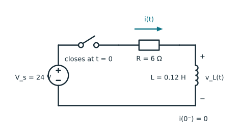
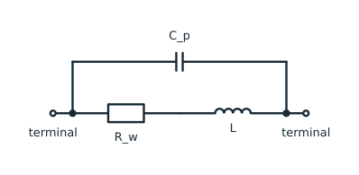

## What you will learn

After this tutorial, you will be able to:

- use the constitutive relation $v=L\,di/dt$ with a stated sign convention;
- explain why ideal-inductor current cannot jump instantaneously;
- calculate magnetic energy and sinusoidal reactance;
- interpret an inductor during a DC switching transient; and
- distinguish the ideal model from important practical limitations.

## Prerequisites

- Voltage, current, power, and basic calculus.

## 1. The ideal inductor

An **inductor** is a two-terminal component that stores energy in a magnetic field. Its defining parameter is the **inductance** $L$, measured in the [SI unit henries (H)](https://en.wikipedia.org/wiki/Henry_(unit)).

![IEC general symbol for a coil or inductor (symbol S00583) [@iec60617].](figures/generated/inductor-iec-symbol.svg){#fig-inductor-iec-symbol fig-align="center" width="38%"}

With the passive sign convention, the ideal linear inductor satisfies

$$
v(t)=L\frac{di(t)}{dt}.
$$ {#eq-inductor-law}

::: {.callout-note title="Passive sign convention"}
The terminal where the current enters is marked positive.
:::

One henry is one volt-second per ampere:

$$
1\ \mathrm{H}=1\ \frac{\mathrm{V\,s}}{\mathrm{A}}.
$$

Examining @eq-inductor-law we find interesting things:

- constant current gives $v=0$ for an ideal inductor;
- a faster current change requires a larger voltage; and
- for the same voltage, a larger inductance makes current change more slowly.

Wait, but how is @eq-inductor-law derived? 
For a linear magnetic system, the flux linkage $\lambda$ is

$$
\lambda=Li,
$$

and Faraday's law gives $v=d\lambda/dt$. Together these relations lead to Equation @eq-inductor-law [@grainger1994].


## 2. Why current is continuous

Integrating Equation @eq-inductor-law over a short interval gives

$$
i(t_2)-i(t_1)=\frac{1}{L}\int_{t_1}^{t_2}v(t)\,dt.
$$ {#eq-inductor-current-integral}

For finite voltage, the integral approaches zero as the interval shrinks. Therefore the current through an ideal inductor cannot change instantaneously:

$$
i(0^+)=i(0^-).
$$


::: {.callout-warning}
## “An inductor is a short circuit at DC” needs a condition

In a settled DC steady state, $di/dt=0$, so an ideal inductor has zero voltage and behaves like a short circuit. However, during switching, or when it carries stored current, replacing it with a short circuit discards the transient.
:::

## 3. Power and stored magnetic energy

With the passive sign convention, instantaneous power absorbed by the inductor is

$$
p(t)=v(t)i(t)=L i(t)\frac{di(t)}{dt}.
$$

For an ideal linear inductor, zero current means no magnetic field and therefore no stored magnetic energy. Choose a reference time $t_0$ at which $i(t_0)=0$; then $w_L(t_0)=0$. The energy absorbed between $t_0$ and $t$ is the time integral of power. Substituting the expression for $p(t)$ and changing the integration variable from time to current gives

$$
\begin{aligned}
w_L(t)
&=\int_{t_0}^{t}p(\tau)\,d\tau \\
&=\int_{t_0}^{t}L i(\tau)\frac{di(\tau)}{d\tau}\,d\tau \\
&=\int_{0}^{i(t)}L\xi\,d\xi \\
&=\frac{1}{2}L i^2(t).
\end{aligned}
$$ {#eq-inductor-energy}

From the final expression we see that the stored magnetic energy of an ideal linear inductor depends on the instantaneous current $i(t)$, not on its history.

::: {.callout-important title="Stored, not dissipated"}
Unlike an ideal [resistor](resistor.qmd), an ideal inductor does not convert this energy into heat.
:::


## 4. Series and parallel combinations

The following rules apply to ideal, linear inductors that have no magnetic coupling.

**Series connection.** The same current $i$ flows through each inductor. Their voltages add, so

$$
v_{\mathrm{total}}=v_1+v_2+\cdots
=(L_1+L_2+\cdots)\frac{di}{dt}.
$$

Because $v_{\mathrm{total}}=L_{\mathrm{eq}}\,di/dt$, the equivalent inductance is

$$
L_{\mathrm{eq}}=L_1+L_2+\cdots.
$$

Adding uncoupled inductors in series therefore increases the inductance.

**Parallel connection.** All inductors have the same voltage $v$. From the integral form of @eq-inductor-law, their current changes are

$$
\Delta i_k=\frac{1}{L_k}\int_{t_1}^{t_2}v(t)\,dt.
$$

The branch currents add. Hence,

$$
\Delta i_{\mathrm{total}}
=\left(\frac{1}{L_1}+\frac{1}{L_2}+\cdots\right)
\int_{t_1}^{t_2}v(t)\,dt,
$$

which gives

$$
\frac{1}{L_{\mathrm{eq}}}
=\frac{1}{L_1}+\frac{1}{L_2}+\cdots.
$$

For two parallel inductors,

$$
L_{\mathrm{eq}}=\frac{L_1L_2}{L_1+L_2}.
$$

For $n\geq 2$ positive inductances,

$$
\frac{1}{L_{\mathrm{eq}}}
=\sum_{k=1}^{n}\frac{1}{L_k}
>\frac{1}{L_j}
\quad\Longrightarrow\quad
L_{\mathrm{eq}}<L_j,
\qquad \forall j\in\{1,\ldots,n\}.
$$

Thus, $L_{\mathrm{eq}}<\min(L_1,\ldots,L_n)$: an uncoupled parallel combination has a smaller inductance than any individual inductor. 

If the flux from one coil links another, [mutual inductance](https://openstax.org/books/university-physics-volume-2/pages/14-1-mutual-inductance) terms must be included. In that case, simply adding or reciprocally combining the self-inductances can be wrong.

## 5. Sinusoidal steady state

For angular frequency $\omega=2\pi f$, the [sinusoidal steady-state phasor transformation and its differentiation rule](complex-numbers-in-ac-circuits.qmd#sec-phasor-differentiation) give

$$
\frac{dx(t)}{dt}
\quad\longleftrightarrow\quad
j\omega\underline X.
$$

Applying this rule to @eq-inductor-law gives

$$
\underline V=j\omega L\,\underline I,
$$

which shows that the inductor voltage leads its current by $90^\circ$, because multiplication by $j$ rotates a phasor counter-clockwise by $90^\circ$.

Impedance is the ratio of voltage phasor to current phasor. Substituting $\underline V=j\omega L\,\underline I$ gives

$$
Z_L
=\frac{\underline V}{\underline I}
=\frac{j\omega L\,\underline I}{\underline I}
=j\omega L
=jX_L,
\qquad
X_L=\omega L.
$$ {#eq-inductor-impedance}

Here, $X_L$ is the positive magnitude of the inductive reactance. Thus, the impedance is purely positive imaginary, and its magnitude increases as frequency increases.

For RMS current $I$, the complex power absorbed by an ideal inductor is

$$
\underline S=\underline V\underline I^*=j\omega L I^2.
$$

Its average active power is zero, while its reactive power is positive:

$$
P=0,
\qquad
Q=\omega L I^2.
$$

The inductor consumes zero active power because it stores energy during part of every cycle and returns it during the rest of the cycle. Because inductive reactance produces lagging current, inductors absorb reactive power from the network. See [power factor](power-factor-in-ac-circuits.qmd) for how an inductor affects an AC system.

::: {.callout-note}
## Frequency limits

At $f=0$, @eq-inductor-impedance has zero magnitude, matching the short-circuit DC steady-state model. The ideal formula should not be extrapolated to arbitrarily high frequency because real inductors also contain resistance and parasitic capacitance.
:::

## 6. Worked example: an RL switching transient

Consider a $24$ V ideal source applied at $t=0$ to a series combination of $R=6\ \Omega$ and $L=0.12$ H, as shown in @fig-rl-switching-circuit. Assume $i(0^-)=0$.

{#fig-rl-switching-circuit fig-align="center" width="85%"}

For $t\geq0$, Kirchhoff's voltage law around the loop gives

$$
V_s=Ri(t)+L\frac{di(t)}{dt}.
$$ {#eq-rl-kvl}

After the transient has settled, $di/dt=0$. The final current is therefore

$$
I_\infty=\frac{V_s}{R}=4\ \mathrm{A}.
$$ {#eq-rl-final-current}

Using $V_s=RI_\infty$ in @eq-rl-kvl and defining the time constant $tau=L/R$ gives

$$
\frac{di(t)}{dt}
=\frac{R}{L}\left(I_\infty-i(t)\right)
=\frac{1}{\tau}\left(I_\infty-i(t)\right).
$$ {#eq-rl-differential-equation}

Inductor current is continuous, so the initial condition $i(0^-)=0$ also gives $i(0^+)=0$. Separating the current and time variables and integrating from the initial state to the state at time $t$ yields

$$
\int_{0}^{i(t)}\frac{d\xi}{I_\infty-\xi}
=\int_{0}^{t}\frac{d\eta}{\tau}.
$$ {#eq-rl-separated-integral}

Evaluating the integrals gives

$$
\ln\left(\frac{I_\infty}{I_\infty-i(t)}\right)
=\frac{t}{\tau}.
$$ {#eq-rl-integrated-response}

Exponentiating and solving for $i(t)$ gives

$$
i(t)=I_\infty\left(1-e^{-t/\tau}\right),
$$ {#eq-rl-current}

Ohm's law gives the resistor voltage, and Kirchhoff's voltage law then gives the inductor voltage:

$$
\begin{aligned}
v_R(t)&=Ri(t)=V_s\left(1-e^{-t/\tau}\right),\\
v_L(t)&=V_s-v_R(t)=V_s e^{-t/\tau}.
\end{aligned}
$$ {#eq-rl-voltages}

### Explore the transient interactively

Adjust $R$ and $L$ below. The plots compare the selected circuit with the original $R=6\ \Omega$, $L=0.12$ H example. The horizontal axis uses the same absolute time scale in both plots, so a larger $L/R$ ratio visibly slows the response.

::: {.transient-explorer}
::: {.transient-controls}
```{ojs}
//| echo: false
viewof resistance_ohm = Inputs.range([1, 20], {
  value: 6,
  step: 1,
  label: "Resistance R (Ω)"
})
```

```{ojs}
//| echo: false
viewof inductance_mh = Inputs.range([20, 500], {
  value: 120,
  step: 10,
  label: "Inductance L (mH)"
})
```
:::

```{ojs}
//| echo: false
rl = {
  const sourceVoltage = 24;
  const resistance = resistance_ohm;
  const inductance = inductance_mh * 1e-3;
  const tau = inductance / resistance;
  const baselineTau = 0.12 / 6;
  const finalCurrent = sourceVoltage / resistance;

  return {
    sourceVoltage,
    resistance,
    inductance,
    tau,
    baselineTau,
    finalCurrent,
    currentAtTau: finalCurrent * (1 - Math.exp(-1)),
    finalEnergy: 0.5 * inductance * finalCurrent ** 2
  };
}
```

```{ojs}
//| echo: false
html`<div class="transient-metrics" aria-live="polite">
  <div class="transient-metric"><span>Time constant</span><strong>${(1e3 * rl.tau).toFixed(2)} ms</strong></div>
  <div class="transient-metric"><span>Final current</span><strong>${rl.finalCurrent.toFixed(3)} A</strong></div>
  <div class="transient-metric"><span>Current at <i>t</i> = <i>τ</i></span><strong>${rl.currentAtTau.toFixed(3)} A</strong></div>
  <div class="transient-metric"><span>Final stored energy</span><strong>${rl.finalEnergy.toFixed(3)} J</strong></div>
</div>`
```

```{ojs}
//| echo: false
rl_data = {
  const pointCount = 321;
  const timeMaximum = 5 * Math.max(rl.tau, rl.baselineTau);
  const times = Array.from(
    {length: pointCount},
    (_, index) => index * timeMaximum / (pointCount - 1)
  );

  const current = times.map((time) => ({
    timeMs: 1e3 * time,
    value: rl.finalCurrent * (1 - Math.exp(-time / rl.tau))
  }));

  const baselineCurrent = times.map((time) => ({
    timeMs: 1e3 * time,
    value: 4 * (1 - Math.exp(-time / rl.baselineTau))
  }));

  const voltage = times.flatMap((time) => {
    const decay = Math.exp(-time / rl.tau);
    return [
      {timeMs: 1e3 * time, value: rl.sourceVoltage * decay, series: "Inductor voltage v_L"},
      {timeMs: 1e3 * time, value: rl.sourceVoltage * (1 - decay), series: "Resistor voltage v_R"}
    ];
  });

  const baselineVoltage = times.map((time) => ({
    timeMs: 1e3 * time,
    value: rl.sourceVoltage * (1 - Math.exp(-time / rl.baselineTau))
  }));

  return {timeMaximumMs: 1e3 * timeMaximum, current, baselineCurrent, voltage, baselineVoltage};
}
```

#### Current response

<div class="transient-plot-legend" aria-label="Current-response legend">
  <span class="transient-legend-item"><span class="transient-legend-line transient-legend-line--state"></span>Selected $i(t)$</span>
  <span class="transient-legend-item"><span class="transient-legend-line transient-legend-line--baseline"></span>Baseline $i(t)$</span>
  <span class="transient-legend-item"><span class="transient-legend-tau"></span>Selected $\tau$</span>
</div>

```{ojs}
//| echo: false
Plot.plot({
  width,
  height: 300,
  marginLeft: 58,
  style: {background: "transparent"},
  ariaLabel: "RL switching current response",
  ariaDescription: "Inductor current rises from zero toward the source voltage divided by resistance after the switch closes.",
  x: {
    domain: [0, rl_data.timeMaximumMs],
    label: "Time t (ms)",
    grid: true
  },
  y: {
    domain: [0, Math.max(rl.finalCurrent, 4)],
    label: "Current (A)",
    grid: true
  },
  marks: [
    Plot.ruleY([0]),
    Plot.line(rl_data.baselineCurrent, {
      x: "timeMs",
      y: "value",
      stroke: "#7b8790",
      strokeDasharray: "6,4",
      strokeWidth: 2
    }),
    Plot.line(rl_data.current, {
      x: "timeMs",
      y: "value",
      stroke: "#087f8c",
      strokeWidth: 2.5
    }),
    Plot.ruleX([1e3 * rl.tau], {
      stroke: "#087f8c",
      strokeDasharray: "3,3",
      strokeWidth: 1.5
    })
  ]
})
```

#### Voltage response

<div class="transient-plot-legend" aria-label="Voltage-response legend">
  <span class="transient-legend-item"><span class="transient-legend-line transient-legend-line--state"></span>Selected $v_L(t)$</span>
  <span class="transient-legend-item"><span class="transient-legend-line transient-legend-line--resistor"></span>Selected $v_R(t)$</span>
  <span class="transient-legend-item"><span class="transient-legend-line transient-legend-line--baseline"></span>Baseline $v_R(t)$</span>
  <span class="transient-legend-item"><span class="transient-legend-tau"></span>Selected $\tau$</span>
</div>

```{ojs}
//| echo: false
Plot.plot({
  width,
  height: 270,
  marginLeft: 58,
  style: {background: "transparent"},
  ariaLabel: "RL switching voltage response",
  ariaDescription: "Inductor voltage falls while resistor voltage rises after the switch closes.",
  x: {
    domain: [0, rl_data.timeMaximumMs],
    label: "Time t (ms)",
    grid: true
  },
  y: {
    domain: [0, rl.sourceVoltage],
    label: "Voltage (V)",
    grid: true
  },
  color: {
    domain: ["Inductor voltage v_L", "Resistor voltage v_R"],
    range: ["#087f8c", "#d97706"],
    legend: false
  },
  marks: [
    Plot.ruleY([0]),
    Plot.line(rl_data.baselineVoltage, {
      x: "timeMs",
      y: "value",
      stroke: "#7b8790",
      strokeDasharray: "6,4",
      strokeWidth: 2
    }),
    Plot.line(rl_data.voltage, {
      x: "timeMs",
      y: "value",
      stroke: "series",
      strokeWidth: 2.5
    }),
    Plot.ruleX([1e3 * rl.tau], {
      stroke: "#087f8c",
      strokeDasharray: "3,3",
      strokeWidth: 1.5
    })
  ]
})
```

The vertical teal line marks the selected time constant $\tau$. At $t=\tau$, the inductor has reached $1-e^{-1}\approx63.2\%$ of its final current, regardless of the chosen values of $R$ and $L$.
:::

The following Python example reproduces the original $6\ \Omega$, $0.12$ H case and checks current continuity, Kirchhoff's voltage law, and the $63.2\%$ time-constant result.

```{python}
#| label: lst-inductor-rl-transient

import numpy as np

V_source = 24.0   # V
R = 6.0           # ohm
L = 0.12          # H

tau = L / R
I_final = V_source / R
t = np.linspace(0.0, 5.0 * tau, 501)

current = I_final * (1.0 - np.exp(-t / tau))
v_inductor = V_source * np.exp(-t / tau)
v_resistor = R * current
energy = 0.5 * L * current**2

index_tau = np.argmin(np.abs(t - tau))
kvl_error = np.max(np.abs(V_source - v_resistor - v_inductor))

print(f"Time constant: {1e3 * tau:.1f} ms")
print(f"Current at one time constant: {current[index_tau]:.3f} A")
print(f"Fraction of final current: {current[index_tau] / I_final:.4f}")
print(f"Maximum KVL residual: {kvl_error:.2e} V")
print(f"Stored energy after 5 tau: {energy[-1]:.3f} J")

assert np.isclose(current[0], 0.0)
assert np.isclose(current[index_tau] / I_final, 1.0 - np.exp(-1.0))
assert kvl_error < 1e-12

print("\nSelected points")
print("t/tau    current (A)    v_L (V)    v_R (V)")
for multiple in (0, 1, 2, 5):
    k = np.argmin(np.abs(t - multiple * tau))
    print(
        f"{multiple:>5}    {current[k]:>11.3f}"
        f"    {v_inductor[k]:>7.3f}    {v_resistor[k]:>7.3f}"
    )
```

At $t=0^+$, the current is still zero, so the resistor voltage is zero and the entire source voltage appears across the inductor. As the magnetic field builds, the current and resistor voltage rise while the inductor voltage falls.

## 7. Where the ideal model stops working

A common first-order equivalent circuit places winding resistance $R_\mathrm{w}$ in series with the ideal inductance and parasitic capacitance $C_\mathrm{p}$ across the two terminals, as shown in @fig-practical-inductor-model.

{#fig-practical-inductor-model fig-align="center" width="85%"}

The elements in this practical model and further nonideal effects represent:

- **[winding resistance](https://www.coilcraft.com/en-us/resources/application-notes/getting-started-an-introduction-to-inductor-specif/)** $R_\mathrm{w}$, which dissipates $I^2R_\mathrm{w}$ heat;
- **[core loss](https://www.we-online.com/en/support/knowledge/application-notes?d=anp029-accurate-inductor-loss-determination-using-redexpert)**, caused by [hysteresis](https://openstax.org/books/university-physics-volume-2/pages/12-7-magnetism-in-matter) and [eddy currents](https://openstax.org/books/university-physics-volume-2/pages/13-5-eddy-currents);
- **[saturation](https://www.coilcraft.com/en-us/resources/application-notes/basics-of-inductor-selection-%28from-electronic-desi/)**, which makes incremental inductance fall at high flux or current;
- **[parasitic capacitance](https://www.coilcraft.com/en-us/resources/application-notes/common-mode-filter-inductor-analysis/)** $C_\mathrm{p}$, which creates a [self-resonant frequency](https://www.coilcraft.com/en-us/resources/application-notes/measuring-self-resonant-frequency/);
- inductance and loss that vary with frequency, current, and temperature; and
- [limits on current and temperature](https://www.coilcraft.com/en-us/resources/application-notes/current-and-temperature-ratings/), together with insulation-voltage limits.

Above its self-resonant frequency, a real inductor can behave more capacitively than inductively. A practical coil also has a nonzero DC voltage drop whenever its winding carries current. Component construction, core material, and ratings therefore matter alongside the nominal inductance.

## 8. Takeaways

- An ideal linear inductor obeys $v(t)=L\frac{di(t)}{dt}$ under the passive sign convention.
- Finite voltage cannot change ideal-inductor current instantaneously.
- It stores magnetic energy $w_L(t)==\frac{1}{2}L i^2(t)$ and can return that energy to the circuit.
- In sinusoidal steady state, $Z_L=j\omega L$. Current lags voltage by $90^\circ$.
- In settled DC steady state it behaves as a short circuit, but not during a transient.
- Real inductors also have resistance, loss, saturation, capacitance, and operating limits.

Next, compare this magnetic energy-storage element with the electric energy storage of a [capacitor](capacitor.qmd).

## References {.unnumbered}

::: {#refs}
:::
