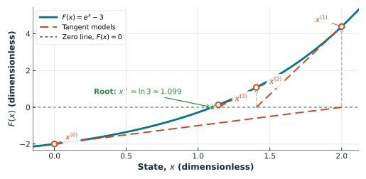

## What you will learn

After working through this tutorial, you should be able to:

- define an AC power-flow calculation in terms of its inputs and outputs;
- write the nonlinear active- and reactive-power balance equations;
- identify the state variables and specified quantities for each bus type;
- explain the structure of the Newton-Raphson Jacobian; and
- implement a power-flow calculation with Python.

## Prerequisites

- RMS phasors, complex power, per-unit quantities, and nodal network equations.
- [Complex-numbers tutorial](complex-numbers-in-ac-circuits.qmd): phasors and complex power.
- [Per-unit tutorial](per-unit-values.qmd): practical network-model normalisation.
- [Y-bus tutorial](y-bus-matrix.qmd): admittance stamping and $\mathbf I=\mathbf Y_{\mathrm{bus}}\mathbf V$.
- Partial derivatives and linear systems.
- Python, NumPy, Power Grid Model, and pandapower.

## 1. What is a power-flow calculation?

An **AC power-flow calculation** determines the sinusoidal steady-state operating point of a network. Given an energised network model and a consistent set of power and voltage specifications, it solves for the complex bus-voltage phasors that satisfy Kirchhoff's laws and the nonlinear power flow equations.

More precisely, consider a connected network with bus-admittance matrix $\mathbf Y_{\mathrm{bus}}$, one slack bus $s$, a set $\mathcal{PV}$ of PV buses, and a set $\mathcal{PQ}$ of PQ buses. For any candidate voltage vector $\mathbf V\in\mathbb C^n$, define the calculated complex injections by

$$
\mathbf S(\mathbf V)
=\operatorname{diag}(\mathbf V)
\overline{\left(\mathbf Y_{\mathrm{bus}}\mathbf V\right)}
=\mathbf P(\mathbf V)+\mathrm{j}\mathbf Q(\mathbf V).
$$ {#eq-power-flow-map}

Here the overbar denotes elementwise complex conjugation.

The conventional AC power-flow problem is: **find the bus-voltage vector $\mathbf V$** such that

$$
\begin{aligned}
|V_s|&=|V_s|^{\mathrm{spec}},
&\theta_s&=\theta_s^{\mathrm{spec}},
&&& \text{(slack bus)},\\
P_i(\mathbf V)&=P_i^{\mathrm{spec}},
&|V_i|&=|V_i|^{\mathrm{spec}},
&&i&\in\mathcal{PV},\\
P_i(\mathbf V)&=P_i^{\mathrm{spec}},
&Q_i(\mathbf V)&=Q_i^{\mathrm{spec}},
&&i&\in\mathcal{PQ}.
\end{aligned}
$$ {#eq-power-flow-definition}

Thus, the network and the quantities marked “spec” are inputs, whereas the voltage angles at PV and PQ buses and the voltage magnitudes at PQ buses are unknown. After solving for $\mathbf V$, $P_s$, $Q_s$, the PV-bus reactive injections, and all branch currents and powers are calculated outputs. [Section 2](#sec-network-model) derives the map in @eq-power-flow-map, and [Section 3](#sec-bus-types) explains why the conditions in @eq-power-flow-definition give exactly as many scalar equations as unknowns.

The main inputs describe one network snapshot:

| Input category | Examples |
|---|---|
| Network model | In-service buses, lines, transformers, shunts, switch states, and their electrical parameters |
| Power injection specifications | Scheduled generator active power and net active and reactive demand |
| Voltage controls | Slack-bus voltage magnitude and angle, PV-bus voltage setpoints, and fixed tap or shunt settings |
| Numerical settings | Initial voltage estimate, residual tolerance, and iteration limit |

: Principal inputs to an AC power-flow calculation {#tbl-pf-inputs}

::: {.callout-important}
### Branch powers are not standard power-flow inputs

A standard nodal power-flow calculation does **not** accept the active and reactive power flow on each branch as prescribed inputs. If branch-power measurements are supplied to infer the network state, that is a state-estimation problem rather than a standard power-flow calculation.
:::

The primary solved output is the complex voltage at every bus, usually reported as magnitude $|V_i|$ and angle $\theta_i$. Once those voltages are known, the network equations give the remaining quantities:

- active and reactive injection at the slack bus;
- reactive injection at PV buses;
- currents and active and reactive power flows at both ends of every branch;
- network losses; and
- equipment loading and voltage-limit diagnostics.

Not every electrical quantity is specified independently. In the conventional bus formulation used here, two of $P$, $Q$, $|V|$, and $\theta$ are supplied at each bus and the other two are calculated, according to the bus type introduced in @tbl-bus-types. Specifying all four would generally overconstrain the problem.

::: {.callout-note}
Power flow is a steady-state **what-if calculation**, not a time-domain simulation and not a state estimator. It computes the operating point implied by the model and schedules; it does not infer the most likely state from redundant noisy measurements.
:::

## 2. Network model {#sec-network-model}

Consider a balanced three-phase network represented by its positive-sequence bus-admittance matrix. Throughout this tutorial, voltage, current, admittance, and power are expressed in per unit on coherent three-phase bases. The nodal equation is

$$
\mathbf{I} = \mathbf{Y}_{\mathrm{bus}}\mathbf{V}.
$$

Its equation at bus $i$ is

$$
I_i=\sum_{k=1}^{n}Y_{ik}V_k,
$$ {#eq-bus-current}

where $I_i$ is the current injected from bus $i$ into the network. Write the voltage and admittance entries as

$$
V_i=|V_i|e^{\mathrm{j}\theta_i},
\qquad
Y_{ik}=G_{ik}+\mathrm{j}B_{ik}.
$$

The corresponding complex-power injection is

$$
S_i = P_i + \mathrm{j}Q_i = V_i I_i^*.
$$ {#eq-complex-power}

::: {.callout-note}
With coherent three-phase per-unit bases, $V_iI_i^*$ is the **total three-phase power in per unit**. If $V_i$ and $I_i$ instead denote physical RMS phase quantities, the total balanced three-phase power is $S_{i,3\phi}=3V_iI_i^*$.
:::

To separate active and reactive power, first conjugate @eq-bus-current:

$$
I_i^*
=\sum_{k=1}^{n}Y_{ik}^*V_k^*
=\sum_{k=1}^{n}
\left(G_{ik}-\mathrm{j}B_{ik}\right)
|V_k|e^{-\mathrm{j}\theta_k}.
$$ {#eq-conjugate-bus-current}

Substitute this expression and $V_i=|V_i|e^{\mathrm{j}\theta_i}$ into @eq-complex-power. With $\theta_{ik}=\theta_i-\theta_k$,

$$
S_i
=\sum_{k=1}^{n}|V_i||V_k|
\left(G_{ik}-\mathrm{j}B_{ik}\right)
e^{\mathrm{j}\theta_{ik}}.
$$ {#eq-complex-power-expanded}

Euler's identity gives $e^{\mathrm{j}\theta_{ik}}=\cos\theta_{ik}+\mathrm{j}\sin\theta_{ik}$. Multiplying the two complex factors yields

$$
\begin{aligned}
&\left(G_{ik}-\mathrm{j}B_{ik}\right)
\left(\cos\theta_{ik}+\mathrm{j}\sin\theta_{ik}\right)\\
&\quad=
\left(G_{ik}\cos\theta_{ik}+B_{ik}\sin\theta_{ik}\right)
+\mathrm{j}\left(G_{ik}\sin\theta_{ik}-B_{ik}\cos\theta_{ik}\right).
\end{aligned}
$$ {#eq-admittance-angle-product}

Therefore,

$$
\begin{aligned}
S_i
=\sum_{k=1}^{n}|V_i||V_k|
\big[&G_{ik}\cos\theta_{ik}+B_{ik}\sin\theta_{ik}\\
&+\mathrm{j}\left(G_{ik}\sin\theta_{ik}-B_{ik}\cos\theta_{ik}\right)\big].
\end{aligned}
$$ {#eq-power-real-imaginary-parts}

Finally, compare the real and imaginary parts of this expression with $S_i=P_i+\mathrm{j}Q_i$. The real part is the active-power injection,

$$
P_i = \sum_{k=1}^{n}|V_i||V_k|
\left[G_{ik}\cos(\theta_i-\theta_k)
+B_{ik}\sin(\theta_i-\theta_k)\right],
$$ {#eq-active-power}

and the imaginary part is the reactive-power injection,

$$
Q_i = \sum_{k=1}^{n}|V_i||V_k|
\left[G_{ik}\sin(\theta_i-\theta_k)
-B_{ik}\cos(\theta_i-\theta_k)\right].
$$ {#eq-reactive-power}

These equations are nonlinear because voltage magnitudes multiply one another and the phase angles appear inside trigonometric functions.

## 3. Bus types and unknowns {#sec-bus-types}

The equations solved at a bus depend on what is specified.

| Bus type | Specified | Calculated |
|---|---|---|
| Slack | $|V|,\ \theta$ | $P,\ Q$ |
| PV (generator) | $P,\ |V|$ | $\theta,\ Q$ |
| PQ (load) | $P,\ Q$ | $\theta,\ |V|$ |

: Conventional power-flow bus types {#tbl-bus-types}

The bus specifications and reduced polar variable selection follow the conventional formulation in Grainger and Stevenson [@grainger1994, pp. 331--334, 353].

The slack-bus angle provides the angular reference. Because its voltage magnitude and angle are fixed, the slack-bus active and reactive injections are calculated after the voltage solution and account for the net power imbalance and network losses.

Let $p_1,\ldots,p_{n_{\mathrm{PV}}}$ denote the PV buses and $q_1,\ldots,q_{n_{\mathrm{PQ}}}$ the PQ buses. In the conventional polar formulation, the reduced Newton state vector is

$$
\mathbf x=
\begin{bmatrix}
\boldsymbol\theta_{\mathrm{PV}}\\
\boldsymbol\theta_{\mathrm{PQ}}\\
|\mathbf V|_{\mathrm{PQ}}
\end{bmatrix}
=
=
\begin{bmatrix}
\theta_{p_1}\\
\vdots\\
\theta_{p_{n_{\mathrm{PV}}}}\\
\theta_{q_1}\\
\vdots\\
\theta_{q_{n_{\mathrm{PQ}}}}\\
|V_{q_1}|\\
\vdots\\
|V_{q_{n_{\mathrm{PQ}}}}|
\end{bmatrix}.
$$ {#eq-newton-state-vector}

Every PV bus contributes one unknown angle. Every PQ bus contributes one unknown angle and one unknown voltage magnitude. The slack-bus voltage magnitude and angle are specified, so neither appears in $\mathbf x$. Consequently,

$$
\dim(\mathbf x)
=(n_{\mathrm{PV}}+n_{\mathrm{PQ}})+n_{\mathrm{PQ}}
=n_{\mathrm{PV}}+2n_{\mathrm{PQ}}.
$$ {#eq-newton-state-dimension}

The reactive-power injection at a PV bus and the active- and reactive-power injections at the slack bus are calculated outputs, not additional state variables.

## 4. Power flow calculation procedures

The network model supplies $\mathbf Y_{\mathrm{bus}}$, and the bus types determine both the specified quantities and the unknown state $\mathbf x$. The remaining task is to find the state for which the injections calculated from @eq-active-power and @eq-reactive-power equal the retained specifications. Because those equations are nonlinear, the solution is obtained through repeated local corrections:

1. Choose an initial estimate of the unknown angles and PQ-bus voltage magnitudes.
2. Reconstruct the complete bus-voltage vector, inserting the specified slack and PV values.
3. Calculate $P_i$ and $Q_i$ from the current voltages.
4. Compare the calculated injections with the specified injections retained for each bus type.
5. Stop if the largest absolute residual component is below the tolerance.
6. Otherwise, linearise the calculated injections, solve for a state correction, update the state, and repeat.

A flat start commonly sets the unknown angles to zero and the unknown magnitudes to $1$ p.u. This is convenient, but it is not universally reliable. Heavily loaded systems, poor scaling, binding reactive-power limits, or an initial point far from the feasible region can lead to slow convergence or divergence.

### The residual that Newton must drive to zero

Using the same ordering as @eq-newton-state-vector, collect the retained specified injections and the corresponding calculated injections as

$$
\mathbf s^{\mathrm{spec}}=
\begin{bmatrix}
\mathbf P_{\mathrm{PV}}^{\mathrm{spec}}\\
\mathbf P_{\mathrm{PQ}}^{\mathrm{spec}}\\
\mathbf Q_{\mathrm{PQ}}^{\mathrm{spec}}
\end{bmatrix},
\qquad
\mathbf g(\mathbf x)=
\begin{bmatrix}
\mathbf P_{\mathrm{PV}}(\mathbf x)\\
\mathbf P_{\mathrm{PQ}}(\mathbf x)\\
\mathbf Q_{\mathrm{PQ}}(\mathbf x)
\end{bmatrix}.
$$ {#eq-specified-calculated-injections}

The power-flow problem is therefore the square nonlinear system

$$
\mathbf r(\mathbf x)
=\mathbf s^{\mathrm{spec}}-\mathbf g(\mathbf x)
=\begin{bmatrix}
\Delta\mathbf P_{\mathrm{PV}}\\
\Delta\mathbf P_{\mathrm{PQ}}\\
\Delta\mathbf Q_{\mathrm{PQ}}
\end{bmatrix}
=\mathbf 0.
$$ {#eq-power-flow-residual}

Equivalently, any exact power-flow solution is a global minimizer of the squared residual norm with objective value zero:

$$
\mathbf x^\star
\in \underset{\mathbf x}{\operatorname{arg\,min}}
\;\frac{1}{2}\left\|\mathbf r(\mathbf x)\right\|_2^2,
\qquad
\left\|\mathbf r(\mathbf x^\star)\right\|_2=0.
$$ {#eq-power-flow-argmin}

::: {.callout-note}
### Root finding versus minimisation

The zero-residual condition in @eq-power-flow-argmin is essential. If the specifications are infeasible, minimising the squared residual norm may produce a point with a nonzero residual, which is **not** a power-flow solution. The conventional Newton--Raphson method developed below therefore treats @eq-power-flow-residual directly as a square root-finding problem; a least-squares or Gauss--Newton method would be a different algorithm.
:::

Here $\mathbf r(\mathbf x)$ is the **residual vector**. Its entries are conventionally called active- and reactive-power mismatches because each is a specified injection minus its calculated value. At iteration $k$, these components are

$$
\Delta P_i^{(k)} = P_i^{\mathrm{spec}}-P_i(\boldsymbol{\theta}^{(k)},\mathbf{|V|}^{(k)}),
$$

$$
\Delta Q_i^{(k)} = Q_i^{\mathrm{spec}}-Q_i(\boldsymbol{\theta}^{(k)},\mathbf{|V|}^{(k)}).
$$

The residual contains one active-power component for every PV and PQ bus and one reactive-power component for every PQ bus. It therefore has $n_{\mathrm{PV}}+2n_{\mathrm{PQ}}$ entries, exactly matching the dimension of $\mathbf x$ in @eq-newton-state-dimension. There is no slack-bus residual component, no PV-bus reactive-power residual component, and no equation for a quantity that is being treated as a calculated output.

::: {.callout-note}
### Sign convention and terminology

This tutorial follows Grainger and Stevenson’s convention: positive $P_i$ and $Q_i$ are net injections entering the network, so the scheduled injections are generation minus demand and loads have negative specified injections. The scalar differences $\Delta P_i=P_i^{\mathrm{spec}}-P_i^{\mathrm{calc}}$ and $\Delta Q_i=Q_i^{\mathrm{spec}}-Q_i^{\mathrm{calc}}$ are called *mismatches* in the textbook; here, their stacked vector $\mathbf r(\mathbf x)$ is called the *residual vector* [@grainger1994, pp. 330--332].
:::

## 5. Newton--Raphson Iteration

### One Dimension Example
Let's first see an example in one dimension, where the geometry of Newton-Raphson could be shown. Suppose the scalar nonlinear map $g(x)$ must equal a specification $s^{\mathrm{spec}}$, and define the root function $F(x)=g(x)-s^{\mathrm{spec}}$. The desired solution $x^\star$ is a root satisfying $F(x^\star)=0$. At each estimate, Newton's method replaces the curve locally by its tangent; where that tangent crosses zero becomes the next estimate. @fig-newton-raphson-one-dimensional illustrates three such updates for $F(x)=e^x-3$, starting from $x^{(0)}=0$ and approaching the marked root $x^\star=\ln 3$.

{#fig-newton-raphson-one-dimensional fig-align="center" width="88%"}

At iteration $k$, construct the tangent to $F$ at $x^{(k)}$. The $x$-coordinate where this tangent crosses the zero line is, by definition, the next iterate $x^{(k+1)}$. Therefore, $x^{(k+1)}$ satisfies

$$
F(x^{(k)})
+F'(x^{(k)})\left(x^{(k+1)}-x^{(k)}\right)
=0,
$$

so the scalar correction is

$$
\Delta x^{(k)}
=x^{(k+1)}-x^{(k)}
=-\frac{F(x^{(k)})}{F'(x^{(k)})}
=\frac{s^{\mathrm{spec}}-g(x^{(k)})}{g'(x^{(k)})}.
$$ {#eq-scalar-newton-correction}

### Multi-dimensional Newton-Raphson

The multidimensional power-flow step applies the same construction to all retained equations at once. At iteration $k$, linearise the calculated-injection map around the current state:

$$
\mathbf g(\mathbf x^{(k)}+\Delta\mathbf x^{(k)})
\approx
\mathbf g(\mathbf x^{(k)})
+\mathbf J^{(k)}\Delta\mathbf x^{(k)},
\qquad
\mathbf J^{(k)}=
\left.\frac{\partial\mathbf g}{\partial\mathbf x}\right|_{\mathbf x^{(k)}}.
$$ {#eq-newton-linearisation}

The desired correction would make the injections at the corrected state equal the specifications:

$$
\mathbf g\!\left(\mathbf x^{(k)}+\Delta\mathbf x^{(k)}\right)
=\mathbf s^{\mathrm{spec}}.
$$ {#eq-newton-nonlinear-target}

Because the left-hand side is nonlinear, Newton's method does not enforce @eq-newton-nonlinear-target exactly in a single iteration. Instead, it requires the linear approximation in @eq-newton-linearisation to reach the specifications:

$$
\mathbf g(\mathbf x^{(k)})
+\mathbf J^{(k)}\Delta\mathbf x^{(k)}
=\mathbf s^{\mathrm{spec}}.
$$ {#eq-newton-linear-target}

Rearranging gives the Newton system

$$
\mathbf J^{(k)}\Delta\mathbf x^{(k)}
=\mathbf s^{\mathrm{spec}}-\mathbf g(\mathbf x^{(k)})
=\mathbf r(\mathbf x^{(k)}).
$$ {#eq-newton-system}


::: {.callout-important}
### The linear system solved at each iteration

At a nonconverged iteration, $\mathbf J^{(k)}$ and $\mathbf r(\mathbf x^{(k)})$ are known numerical quantities. The linear algebra problem is

$$
\boxed{
\underbrace{\mathbf J^{(k)}}_{\text{coefficient matrix}}
\underbrace{\Delta\mathbf x^{(k)}}_{\text{unknown correction}}
=
\underbrace{\mathbf r(\mathbf x^{(k)})}_{\text{residual vector}}
}.
$$

The solve returns $\Delta\mathbf x^{(k)}$. It does not directly return the final state $\mathbf x$.
:::

When the PV and PQ angle entries are grouped as $\boldsymbol\theta_{\mathrm{PV,PQ}}$, the Newton Jacobian $\mathbf J=\partial\mathbf g/\partial\mathbf x$ of the calculated-injection map defined in @eq-specified-calculated-injections has the four-block form

$$
\begin{aligned}
\begin{bmatrix}
\Delta\mathbf P_{\mathrm{PV,PQ}}\\
\Delta\mathbf Q_{\mathrm{PQ}}
\end{bmatrix}
&=
\underbrace{\begin{bmatrix}
\dfrac{\partial\mathbf P_{\mathrm{PV,PQ}}}
{\partial\boldsymbol\theta_{\mathrm{PV,PQ}}}
&
\dfrac{\partial\mathbf P_{\mathrm{PV,PQ}}}
{\partial|\mathbf V|_{\mathrm{PQ}}}\\[1.2em]
\dfrac{\partial\mathbf Q_{\mathrm{PQ}}}
{\partial\boldsymbol\theta_{\mathrm{PV,PQ}}}
&
\dfrac{\partial\mathbf Q_{\mathrm{PQ}}}
{\partial|\mathbf V|_{\mathrm{PQ}}}
\end{bmatrix}}_{\mathbf J}
\begin{bmatrix}
\Delta\boldsymbol\theta_{\mathrm{PV,PQ}}\\
\Delta|\mathbf V|_{\mathrm{PQ}}
\end{bmatrix}\\[1.2em]
&=
\begin{bmatrix}
\mathbf H & \mathbf N\\
\mathbf M & \mathbf L
\end{bmatrix}
\begin{bmatrix}
\Delta\boldsymbol\theta_{\mathrm{PV,PQ}}\\
\Delta|\mathbf V|_{\mathrm{PQ}}
\end{bmatrix}.
\end{aligned}
$$ {#eq-newton-block-system}


For any vector-valued map, a Jacobian entry has the form

$$
J_{ab}=\frac{\partial g_a}{\partial x_b}.
$$

Thus, row $a$ corresponds to one component $g_a$ of the calculated-output vector, while column $b$ corresponds to one component $x_b$ of the state vector. In this formulation, $\mathbf g(\mathbf x)$ in @eq-specified-calculated-injections stacks calculated power injections, so the Jacobian rows correspond to $P$ and $Q$ equations. The state $\mathbf x$ in @eq-newton-state-vector stacks voltage angles and PQ-bus voltage magnitudes, so the Jacobian columns correspond to $\theta$ and $|V|$ variables.

If full derivative arrays are first formed for every bus, the Newton system includes only these rows and columns:

$$
\begin{aligned}
\text{rows (components of $\mathbf g$):}\quad
&P_i && i\in\mathcal{PV}\cup\mathcal{PQ},
&\qquad Q_i && i\in\mathcal{PQ},\\
\text{columns (components of $\mathbf x$):}\quad
&\theta_i && i\in\mathcal{PV}\cup\mathcal{PQ},
&\qquad |V_i| && i\in\mathcal{PQ}.
\end{aligned}
$$

At a PV bus, $P_i$ and $|V_i|$ are specified, whereas $\theta_i$ and $Q_i$ are calculated, as summarized in @tbl-bus-types. Consequently, there is no prescribed $Q_i^{\mathrm{spec}}$ against which to form a mismatch $\Delta Q_i=Q_i^{\mathrm{spec}}-Q_i(\mathbf x)$. The PV-bus $Q_i$ row is therefore omitted from the Newton system. Its voltage-magnitude column is omitted at the same time because $|V_i|$ is fixed rather than corrected. In other words, one equation ($\Delta Q_i$) and one unknown correction ($\Delta|V_i|$) are omitted together, so the Newton system still has the same number of equations as unknowns. After convergence, evaluate $Q_i(\mathbf x)$ to obtain the reactive injection.

::: {.callout-warning}
### When a PV bus reaches a reactive-power limit

A bus remains PV only while its calculated reactive injection is within the generator limits. If the calculated $Q_i$ violates a limit, a common treatment fixes $Q_i$ at the binding limit and changes the bus from PV to PQ. The $Q_i$ mismatch row and $|V_i|$ correction column then enter the Newton system.
:::

Slack-bus rows and columns remain omitted because both slack-bus voltage variables are specified and both power injections are calculated.

After solving @eq-newton-system, update only the unknown state entries:

$$
\boldsymbol\theta_{\mathrm{PV,PQ}}^{(k+1)}
=\boldsymbol\theta_{\mathrm{PV,PQ}}^{(k)}
+\Delta\boldsymbol\theta_{\mathrm{PV,PQ}}^{(k)},
\qquad
|\mathbf V|_{\mathrm{PQ}}^{(k+1)}
=|\mathbf V|_{\mathrm{PQ}}^{(k)}
+\Delta|\mathbf V|_{\mathrm{PQ}}^{(k)}.
$$

The slack-bus voltage and PV-bus voltage magnitudes remain fixed at their specified values. Near a regular solution, Newton's method typically converges quadratically [@tinney1967].

### Analytical Jacobian entries

We calculate the Jacobian entries analytically because the power injection expressions, i.e., @eq-active-power and @eq-reactive-power  are differentiable.

Let $\theta_{ik}=\theta_i-\theta_k$. For $i\ne k$, differentiating @eq-active-power and @eq-reactive-power gives

$$
\begin{aligned}
H_{ik}=\frac{\partial P_i}{\partial\theta_k}
&=|V_i||V_k|\left(G_{ik}\sin\theta_{ik}-B_{ik}\cos\theta_{ik}\right),\\
N_{ik}=\frac{\partial P_i}{\partial|V_k|}
&=|V_i|\left(G_{ik}\cos\theta_{ik}+B_{ik}\sin\theta_{ik}\right),\\
M_{ik}=\frac{\partial Q_i}{\partial\theta_k}
&=-|V_i||V_k|\left(G_{ik}\cos\theta_{ik}+B_{ik}\sin\theta_{ik}\right),\\
L_{ik}=\frac{\partial Q_i}{\partial|V_k|}
&=|V_i|\left(G_{ik}\sin\theta_{ik}-B_{ik}\cos\theta_{ik}\right).
\end{aligned}
$$ {#eq-jacobian-off-diagonal}

The diagonal entries can be written using the calculated injections:

$$
\begin{aligned}
H_{ii}&=-Q_i-B_{ii}|V_i|^2,
&N_{ii}&=\frac{P_i}{|V_i|}+G_{ii}|V_i|,\\
M_{ii}&=P_i-G_{ii}|V_i|^2,
&L_{ii}&=\frac{Q_i}{|V_i|}-B_{ii}|V_i|.
\end{aligned}
$$ {#eq-jacobian-diagonal}


## 6. An Example in Python

Consider a three-bus system with the following specifications. Positive $P$ and $Q$ denote injection into the network, so the PQ-bus load appears with negative signs.

@fig-three-bus-power-flow-single-line shows the meshed topology, bus roles, and series impedances used in the worked example. It uses IEC-style generator, busbar, and load symbols [@iec60617].

{#fig-three-bus-power-flow-single-line fig-align="center" width="100%"}

| Bus | Type | Specified quantities |
|---:|---|---|
| 1 | Slack | $|V_1|=1.04$, $\theta_1=0$ |
| 2 | PV | $P_2=0.50$, $|V_2|=1.01$ |
| 3 | PQ | $P_3=-0.60$, $Q_3=-0.25$ |

: Three-bus power-flow specification {#tbl-nr-three-bus}

Using the same ordering as @eq-newton-state-vector on the buses in @tbl-nr-three-bus, bus 2 is the only PV bus and bus 3 is the only PQ bus. Every PV bus contributes one unknown angle and every PQ bus contributes one unknown angle and one unknown voltage magnitude, while the slack-bus voltage is specified and therefore omitted. The unknown state is therefore

$$
\mathbf x=
\begin{bmatrix}
\theta_{\mathrm{PV}}\\
\theta_{\mathrm{PQ}}\\
|V|_{\mathrm{PQ}}
\end{bmatrix}
=
\begin{bmatrix}
\theta_2\\
\theta_3\\
|V_3|
\end{bmatrix}.
$$ {#eq-three-bus-state-vector}

Recall that each Newton iteration solves @eq-newton-system for the unknown correction $\Delta\mathbf x^{(k)}$. Specialised to @eq-three-bus-state-vector, this example therefore solves the explicit linear system

$$
\begin{bmatrix}
\dfrac{\partial P_2}{\partial \theta_2} &
\dfrac{\partial P_2}{\partial \theta_3} &
\dfrac{\partial P_2}{\partial |V_3|} \\
\dfrac{\partial P_3}{\partial \theta_2} &
\dfrac{\partial P_3}{\partial \theta_3} &
\dfrac{\partial P_3}{\partial |V_3|} \\
\dfrac{\partial Q_3}{\partial \theta_2} &
\dfrac{\partial Q_3}{\partial \theta_3} &
\dfrac{\partial Q_3}{\partial |V_3|}
\end{bmatrix}^{(k)}
\begin{bmatrix}
\Delta\theta_2 \\
\Delta\theta_3 \\
\Delta|V_3|
\end{bmatrix}^{(k)}
=
\begin{bmatrix}
P_2^{\mathrm{spec}}-P_2^{(k)} \\
P_3^{\mathrm{spec}}-P_3^{(k)} \\
Q_3^{\mathrm{spec}}-Q_3^{(k)}
\end{bmatrix}.
$$ {#eq-three-bus-newton-system}

Recall that a PV bus omits its $Q_i$ residual row and $|V_i|$ correction column together (@tbl-bus-types): there is no $Q_2$ row because bus 2 is a PV bus, and there is no $|V_2|$ correction because its voltage magnitude is specified. The first cell stamps a series-only Y-bus from the branch list and builds $\mathbf x$, $\mathbf g(\mathbf x)$, and $\mathbf s^{\mathrm{spec}}$ from slack, PV, and PQ index arrays in the order of @eq-newton-state-vector. The arrays below encode @tbl-nr-three-bus; editing them adapts the same functions to another network.

```{python}
#| label: lst-nr-three-bus-model
#| code-summary: "Build the network model and retained injection maps"

import numpy as np

np.set_printoptions(precision=6, suppress=True)

# USER INPUTS (0-based bus indices). Edit these lists to change the network.
slack = np.array([0])
pv = np.array([1])
pq = np.array([2])
non_slack = np.concatenate((pv, pq))

slack_angle_rad = np.array([0.0])
slack_voltage_pu = np.array([1.04])
pv_voltage_pu = np.array([1.01])
pv_active_pu = np.array([0.50])
pq_active_pu = np.array([-0.60])
pq_reactive_pu = np.array([-0.25])
initial_pq_voltage_pu = 1.0

lines = [
    (0, 1, 0.02 + 0.06j),
    (0, 2, 0.08 + 0.24j),
    (1, 2, 0.06 + 0.18j),
]

bus_count = max(max(from_bus, to_bus) for from_bus, to_bus, _ in lines) + 1
assert slack.size == 1, "this tutorial uses a single slack bus"

y_bus = np.zeros((bus_count, bus_count), dtype=complex)
for from_bus, to_bus, impedance in lines:
    admittance = 1.0 / impedance
    y_bus[from_bus, from_bus] += admittance
    y_bus[to_bus, to_bus] += admittance
    y_bus[from_bus, to_bus] -= admittance
    y_bus[to_bus, from_bus] -= admittance


def voltage_from_state(state: np.ndarray) -> np.ndarray:
    """Map [theta_PV, theta_PQ, |V|_PQ] to complex bus voltages."""
    n_pv = pv.size
    n_pq = pq.size
    angles = np.empty(bus_count)
    magnitudes = np.empty(bus_count)
    angles[slack] = slack_angle_rad
    magnitudes[slack] = slack_voltage_pu
    angles[pv] = state[:n_pv]
    angles[pq] = state[n_pv : n_pv + n_pq]
    magnitudes[pv] = pv_voltage_pu
    magnitudes[pq] = state[n_pv + n_pq :]
    return magnitudes * np.exp(1j * angles)


def bus_power(state: np.ndarray) -> np.ndarray:
    """Return positive complex-power injections at all buses."""
    voltage = voltage_from_state(state)
    return voltage * (y_bus @ voltage).conjugate()


def retained_injections(state: np.ndarray) -> np.ndarray:
    """Return [P_PV, P_PQ, Q_PQ] in the Newton residual order."""
    power = bus_power(state)
    return np.concatenate((power.real[non_slack], power.imag[pq]))


specified = np.concatenate((pv_active_pu, pq_active_pu, pq_reactive_pu))
```

The next cell evaluates @eq-jacobian-off-diagonal and @eq-jacobian-diagonal for every bus pair, then reduces the Jacobian with the same `non_slack` and `pq` index arrays used above.

```{python}
#| label: lst-nr-three-bus-solve
#| code-summary: "Assemble the reduced Jacobian and solve the power flow"

def power_flow_jacobian(state: np.ndarray) -> np.ndarray:
    """Return the reduced analytical Jacobian for [P_non-slack, Q_PQ]."""
    voltage = voltage_from_state(state)
    magnitude = np.abs(voltage)
    angle = np.angle(voltage)
    power = bus_power(state)
    conductance = y_bus.real
    susceptance = y_bus.imag

    d_p_d_angle = np.empty((bus_count, bus_count))
    d_p_d_magnitude = np.empty((bus_count, bus_count))
    d_q_d_angle = np.empty((bus_count, bus_count))
    d_q_d_magnitude = np.empty((bus_count, bus_count))

    for row in range(bus_count):
        for column in range(bus_count):
            if row == column:
                voltage_squared = magnitude[row] ** 2
                d_p_d_angle[row, row] = (
                    -power.imag[row] - susceptance[row, row] * voltage_squared
                )
                d_p_d_magnitude[row, row] = (
                    power.real[row] / magnitude[row]
                    + conductance[row, row] * magnitude[row]
                )
                d_q_d_angle[row, row] = (
                    power.real[row] - conductance[row, row] * voltage_squared
                )
                d_q_d_magnitude[row, row] = (
                    power.imag[row] / magnitude[row]
                    - susceptance[row, row] * magnitude[row]
                )
                continue

            angle_difference = angle[row] - angle[column]
            sine = np.sin(angle_difference)
            cosine = np.cos(angle_difference)
            magnitude_product = magnitude[row] * magnitude[column]
            g = conductance[row, column]
            b = susceptance[row, column]

            d_p_d_angle[row, column] = magnitude_product * (g * sine - b * cosine)
            d_p_d_magnitude[row, column] = magnitude[row] * (g * cosine + b * sine)
            d_q_d_angle[row, column] = -magnitude_product * (g * cosine + b * sine)
            d_q_d_magnitude[row, column] = magnitude[row] * (g * sine - b * cosine)

    h_block = d_p_d_angle[np.ix_(non_slack, non_slack)]
    n_block = d_p_d_magnitude[np.ix_(non_slack, pq)]
    m_block = d_q_d_angle[np.ix_(pq, non_slack)]
    l_block = d_q_d_magnitude[np.ix_(pq, pq)]
    return np.block([[h_block, n_block], [m_block, l_block]])


# Flat start: unknown angles at the slack angle, PQ magnitudes at 1 p.u.
state = np.concatenate(
    (
        np.full(pv.size, slack_angle_rad[0]),
        np.full(pq.size, slack_angle_rad[0]),
        np.full(pq.size, initial_pq_voltage_pu),
    )
)
tolerance = 1e-10
max_iterations = 8

print("iteration  maximum residual")
for iteration in range(max_iterations):
    residual = specified - retained_injections(state)
    maximum_residual = np.linalg.norm(residual, ord=np.inf)
    print(f"{iteration:9d}  {maximum_residual:16.3e}")

    if maximum_residual < tolerance:
        break

    jacobian = power_flow_jacobian(state)
    correction = np.linalg.solve(jacobian, residual)
    state += correction
else:
    raise RuntimeError("Newton iteration did not converge")

voltage = voltage_from_state(state)
power = bus_power(state)

print("\nconverged bus state")
for bus, (phasor, injection) in enumerate(zip(voltage, power), start=1):
    print(
        f"bus {bus}: |V|={abs(phasor):.5f} p.u., "
        f"theta={np.rad2deg(np.angle(phasor)):+.4f} deg, "
        f"P={injection.real:+.5f}, Q={injection.imag:+.5f} p.u."
    )
```


### Cross-check with Power Grid Model

[Power Grid Model](https://github.com/PowerGridModel/power-grid-model) is an open-source library for steady-state distribution-network analysis, with a C++ calculation core and Python bindings for power flow, state estimation, and short-circuit studies [@powergridmodel]. We can now solve the same physical network with its [`PowerGridModel.calculate_power_flow`](https://power-grid-model.readthedocs.io/en/stable/examples/Power%20Flow%20Example.html#one-time-power-flow-calculation) function and compare the result with our implementation. Power Grid Model accepts physical SI quantities, so choose coherent bases

$$
S_{\mathrm{base}}=100\ \mathrm{MVA},
\qquad
U_{\mathrm{base}}=110\ \mathrm{kV},
\qquad
Z_{\mathrm{base}}=\frac{U_{\mathrm{base}}^2}{S_{\mathrm{base}}}=121\ \Omega.
$$

The particular base values do not change the per-unit solution. Each line impedance is converted using $z_{\Omega}=z_{\mathrm{pu}}Z_{\mathrm{base}}$, and the specified powers are converted using $P_{\mathrm{W}}=P_{\mathrm{pu}}S_{\mathrm{base}}$ and $Q_{\mathrm{var}}=Q_{\mathrm{pu}}S_{\mathrm{base}}$. Zero line capacitance preserves the series-only network used above.

::: {.callout-note}
### Matching the bus models

Power Grid Model represents the PV bus using a constant-power [`sym_gen`](https://power-grid-model.readthedocs.io/en/stable/user_manual/components.html#generic-load-and-generator) together with a [`voltage_regulator`](https://power-grid-model.readthedocs.io/en/stable/user_manual/components.html#voltage-regulator). The regulator calculates the generator's reactive power while holding $|V_2|=1.01$ p.u. Bus 1 is represented by a [`source` with a very large short-circuit power](https://power-grid-model.readthedocs.io/en/stable/user_manual/non-pgm-components.html#ideal-source), so it approximates the ideal slack source used in our equations.
:::

```{python}
#| label: lst-nr-three-bus-power-grid-model
#| code-summary: "Solve the same network with Power Grid Model and compare results"

from power_grid_model import (
    AttributeType,
    CalculationMethod,
    CalculationType,
    ComponentType,
    DatasetType,
    LoadGenType,
    PowerGridModel,
    initialize_array,
)
from power_grid_model.validation import assert_valid_input_data

s_base = 100e6
u_base = 110e3
z_base = u_base**2 / s_base

pgm_node = initialize_array(DatasetType.input, ComponentType.node, 3)
pgm_node[AttributeType.id] = [1, 2, 3]
pgm_node[AttributeType.u_rated] = u_base

pgm_line = initialize_array(DatasetType.input, ComponentType.line, 3)
pgm_line[AttributeType.id] = [12, 13, 23]
pgm_line[AttributeType.from_node] = [1, 1, 2]
pgm_line[AttributeType.to_node] = [2, 3, 3]
pgm_line[AttributeType.from_status] = 1
pgm_line[AttributeType.to_status] = 1
line_impedance_pu = np.array([item[2] for item in lines])
pgm_line[AttributeType.r1] = z_base * line_impedance_pu.real
pgm_line[AttributeType.x1] = z_base * line_impedance_pu.imag
pgm_line[AttributeType.c1] = 0.0
pgm_line[AttributeType.tan1] = 0.0
pgm_line[AttributeType.i_n] = 1e6

pgm_source = initialize_array(DatasetType.input, ComponentType.source, 1)
pgm_source[AttributeType.id] = [101]
pgm_source[AttributeType.node] = [1]
pgm_source[AttributeType.status] = [1]
pgm_source[AttributeType.u_ref] = slack_voltage_pu
pgm_source[AttributeType.u_ref_angle] = slack_angle_rad
pgm_source[AttributeType.sk] = [1e50]
pgm_source[AttributeType.rx_ratio] = [0.1]

pgm_generator = initialize_array(DatasetType.input, ComponentType.sym_gen, 1)
pgm_generator[AttributeType.id] = [102]
pgm_generator[AttributeType.node] = [2]
pgm_generator[AttributeType.status] = [1]
pgm_generator[AttributeType.type] = [LoadGenType.const_power]
pgm_generator[AttributeType.p_specified] = pv_active_pu * s_base
pgm_generator[AttributeType.q_specified] = [0.0]

pgm_regulator = initialize_array(
    DatasetType.input, ComponentType.voltage_regulator, 1
)
pgm_regulator[AttributeType.id] = [103]
pgm_regulator[AttributeType.regulated_object] = [102]
pgm_regulator[AttributeType.status] = [1]
pgm_regulator[AttributeType.u_ref] = pv_voltage_pu

pgm_load = initialize_array(DatasetType.input, ComponentType.sym_load, 1)
pgm_load[AttributeType.id] = [104]
pgm_load[AttributeType.node] = [3]
pgm_load[AttributeType.status] = [1]
pgm_load[AttributeType.type] = [LoadGenType.const_power]
pgm_load[AttributeType.p_specified] = -pq_active_pu * s_base
pgm_load[AttributeType.q_specified] = -pq_reactive_pu * s_base

pgm_input = {
    ComponentType.node: pgm_node,
    ComponentType.line: pgm_line,
    ComponentType.source: pgm_source,
    ComponentType.sym_gen: pgm_generator,
    ComponentType.voltage_regulator: pgm_regulator,
    ComponentType.sym_load: pgm_load,
}

assert_valid_input_data(
    input_data=pgm_input,
    calculation_type=CalculationType.power_flow,
)

pgm_model = PowerGridModel(pgm_input)
pgm_output = pgm_model.calculate_power_flow(
    symmetric=True,
    error_tolerance=1e-10,
    max_iterations=20,
    calculation_method=CalculationMethod.newton_raphson,
)

pgm_bus = pgm_output[ComponentType.node]
np.testing.assert_array_equal(pgm_bus[AttributeType.id], [1, 2, 3])
pgm_voltage_magnitude = pgm_bus[AttributeType.u_pu]
pgm_voltage_angle = pgm_bus[AttributeType.u_angle]
pgm_injection = (
    pgm_bus[AttributeType.p] + 1j * pgm_bus[AttributeType.q]
) / s_base

manual_voltage_magnitude = np.abs(voltage)
manual_voltage_angle = np.angle(voltage)
manual_injection = power

print("bus  |V| manual  |V| PGM    theta manual  theta PGM")
for bus in range(3):
    print(
        f"{bus + 1:3d}  {manual_voltage_magnitude[bus]:10.6f}  "
        f"{pgm_voltage_magnitude[bus]:8.6f}  "
        f"{np.rad2deg(manual_voltage_angle[bus]):+12.6f}  "
        f"{np.rad2deg(pgm_voltage_angle[bus]):+9.6f}"
    )

print("\nbus  P manual   P PGM      Q manual   Q PGM")
for bus in range(3):
    print(
        f"{bus + 1:3d}  {manual_injection[bus].real:+9.6f}  "
        f"{pgm_injection[bus].real:+9.6f}  "
        f"{manual_injection[bus].imag:+9.6f}  "
        f"{pgm_injection[bus].imag:+9.6f}"
    )

maximum_difference = max(
    np.max(np.abs(manual_voltage_magnitude - pgm_voltage_magnitude)),
    np.max(np.abs(manual_voltage_angle - pgm_voltage_angle)),
    np.max(np.abs(manual_injection - pgm_injection)),
)
comparison_tolerance = 1e-10
print(f"\nmaximum difference = {maximum_difference:.3e} p.u. or rad")
if maximum_difference < comparison_tolerance:
    print(
        "manual and Power Grid Model solutions agree within "
        f"{comparison_tolerance:.0e} "
        "(voltages and all bus injections, including slack P/Q and PV Q)."
    )
else:
    print(
        "manual and Power Grid Model solutions differ by more than "
        f"{comparison_tolerance:.0e}."
    )

np.testing.assert_allclose(
    pgm_voltage_magnitude, manual_voltage_magnitude, atol=comparison_tolerance, rtol=0.0
)
np.testing.assert_allclose(
    pgm_voltage_angle, manual_voltage_angle, atol=comparison_tolerance, rtol=0.0
)
np.testing.assert_allclose(
    pgm_injection, manual_injection, atol=comparison_tolerance, rtol=0.0
)
```

Comparing the full bus voltages and injections is a stronger check than testing only the specified $P_2$, $P_3$, and $Q_3$ values.

### Cross-check with pandapower

The same network can also be solved with pandapower's Newton--Raphson power flow [`runpp`](https://pandapower.readthedocs.io/en/v3.5.4/powerflow/ac.html) [@pandapower2026acpowerflow]. Reuse the bases already chosen for Power Grid Model. Series branches are entered as [`impedance`](https://pandapower.readthedocs.io/en/v3.5.4/elements/impedance.html) elements in per unit on $S_{\mathrm{base}}$, so the conversion to ohms is unnecessary here.

::: {.callout-note}
### Matching the bus models

Pandapower models the slack bus with [`ext_grid`](https://pandapower.readthedocs.io/en/v3.5.4/elements/ext_grid.html) and the PV bus with [`gen`](https://pandapower.readthedocs.io/en/v3.5.4/elements/gen.html). The PQ bus is a [`load`](https://pandapower.readthedocs.io/en/v3.5.4/elements/load.html) whose positive $P$ and $Q$ are consumed powers, so they equal the negatives of our injection specifications. Pandapower's bus result table reports power demand; converting with $-S_{\mathrm{bus}}/S_{\mathrm{base}}$ recovers the injection convention used in this tutorial.
:::

```{python}
#| label: lst-nr-three-bus-pandapower
#| code-summary: "Solve the same network with pandapower and compare results"

import pandapower as pp

s_base_mva = s_base / 1e6
u_base_kv = u_base / 1e3

pp_net = pp.create_empty_network(sn_mva=s_base_mva)
pp_buses = [
    pp.create_bus(pp_net, vn_kv=u_base_kv, name=f"bus {bus + 1}")
    for bus in range(bus_count)
]

pp.create_ext_grid(
    pp_net,
    bus=pp_buses[int(slack[0])],
    vm_pu=float(slack_voltage_pu[0]),
    va_degree=float(np.rad2deg(slack_angle_rad[0])),
)
pp.create_gen(
    pp_net,
    bus=pp_buses[int(pv[0])],
    p_mw=float(pv_active_pu[0] * s_base_mva),
    vm_pu=float(pv_voltage_pu[0]),
)
pp.create_load(
    pp_net,
    bus=pp_buses[int(pq[0])],
    p_mw=float(-pq_active_pu[0] * s_base_mva),
    q_mvar=float(-pq_reactive_pu[0] * s_base_mva),
)

for from_bus, to_bus, impedance_pu in lines:
    pp.create_impedance(
        pp_net,
        from_bus=pp_buses[from_bus],
        to_bus=pp_buses[to_bus],
        rft_pu=float(impedance_pu.real),
        xft_pu=float(impedance_pu.imag),
        sn_mva=s_base_mva,
    )

pp.runpp(
    pp_net,
    algorithm="nr",
    calculate_voltage_angles=True,
    init="flat",
    tolerance_mva=1e-10,
    max_iteration=20,
    numba=False,
)

pp_voltage_magnitude = pp_net.res_bus.vm_pu.to_numpy()
pp_voltage_angle = np.deg2rad(pp_net.res_bus.va_degree.to_numpy())
pp_injection = (
    -pp_net.res_bus.p_mw.to_numpy() - 1j * pp_net.res_bus.q_mvar.to_numpy()
) / s_base_mva

print("bus  |V| manual  |V| pp     theta manual  theta pp")
for bus in range(bus_count):
    print(
        f"{bus + 1:3d}  {manual_voltage_magnitude[bus]:10.6f}  "
        f"{pp_voltage_magnitude[bus]:8.6f}  "
        f"{np.rad2deg(manual_voltage_angle[bus]):+12.6f}  "
        f"{np.rad2deg(pp_voltage_angle[bus]):+9.6f}"
    )

print("\nbus  P manual   P pp       Q manual   Q pp")
for bus in range(bus_count):
    print(
        f"{bus + 1:3d}  {manual_injection[bus].real:+9.6f}  "
        f"{pp_injection[bus].real:+9.6f}  "
        f"{manual_injection[bus].imag:+9.6f}  "
        f"{pp_injection[bus].imag:+9.6f}"
    )

maximum_difference_pp = max(
    np.max(np.abs(manual_voltage_magnitude - pp_voltage_magnitude)),
    np.max(np.abs(manual_voltage_angle - pp_voltage_angle)),
    np.max(np.abs(manual_injection - pp_injection)),
)
comparison_tolerance_pp = 1e-10
print(f"\nmaximum difference = {maximum_difference_pp:.3e} p.u. or rad")
if maximum_difference_pp < comparison_tolerance_pp:
    print(
        "manual and pandapower solutions agree within "
        f"{comparison_tolerance_pp:.0e} "
        "(voltages and all bus injections, including slack P/Q and PV Q)."
    )
else:
    print(
        "manual and pandapower solutions differ by more than "
        f"{comparison_tolerance_pp:.0e}."
    )

np.testing.assert_allclose(
    pp_voltage_magnitude, manual_voltage_magnitude, atol=comparison_tolerance_pp, rtol=0.0
)
np.testing.assert_allclose(
    pp_voltage_angle, manual_voltage_angle, atol=comparison_tolerance_pp, rtol=0.0
)
np.testing.assert_allclose(
    pp_injection, manual_injection, atol=comparison_tolerance_pp, rtol=0.0
)
```

::: {.callout-tip}
Try changing the Python inputs above—for example a load, the flat-start voltage, or a line impedance—and rerun the tutorial. The Newton iteration, residual history, and solved voltages will update. Because the Power Grid Model and pandapower cells reuse the same `lines` list and specification arrays, those impedance and injection changes are also reflected in the cross-checks.

Two things stay fixed unless you edit them by hand:

- the table and single-line diagram still show the published three-bus example; and
- the Power Grid Model and pandapower cells still assume this three-bus layout (one slack, one PV, one PQ, three lines), so they are not a general cross-check for an arbitrary new topology.
:::

## 7. Practical checks

Before trusting a solution, verify that:

1. the maximum absolute residual component is below the chosen tolerance;
2. generator reactive-power limits have been enforced consistently;
3. voltage magnitudes and angle differences are physically possible;
4. total generation minus total load equals calculated network losses; and
5. branch flows respect the same sign and per-unit conventions as the bus model.


## References {.unnumbered}

::: {#refs}
:::
