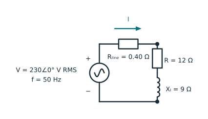
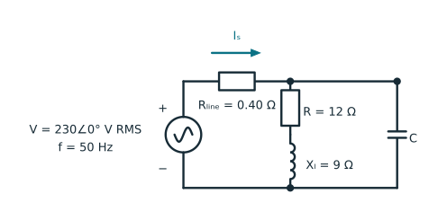

## What you will learn

This tutorial develops how to:

- derive active power and power factor from sinusoidal voltage and current;
- interpret complex power, the power triangle, and leading or lagging current;
- calculate source current, load voltage, and resistive line loss with line resistance;
- explain why low power factor increases current and line loss;
- size a single-phase shunt capacitor to adjust the power factor and line loss;
- explore how capacitance affects source power factor, load voltage, and line loss; and
- recognise when the familiar formula $\mathrm{pf}=\cos\phi$ is not sufficient.

## Prerequisites

- Sinusoidal waveforms and RMS values.
- [Complex-numbers tutorial](complex-numbers-in-ac-circuits.qmd): phasors, impedance, and complex power.

## 1. Active power is only part of the current story

An AC source may need to supply current even when not all of the associated energy is converted into heat, light, or mechanical work. Inductors and capacitors store energy during part of a cycle and return it later. This exchange contributes to RMS current and equipment loading, but its average energy transfer over a complete cycle is zero.

Power factor compares the average active power $P$ with the voltage-current loading:

$$
\mathrm{pf}
=\frac{P}{V_{\mathrm{rms}}I_{\mathrm{rms}}}.
$$ {#eq-pf-general-definition}

For an absorbing load with $P\ge 0$, the magnitude lies between zero and one. A value near one means that most of the available voltage-current product contributes to average power transfer. A lower value means that more current is required for the same active power at the same voltage.

Rearranging @eq-pf-general-definition gives

$$
I_{\mathrm{rms}}
=\frac{P}{V_{\mathrm{rms}}\mathrm{pf}}.
$$ {#eq-pf-current-for-power}

This relation is why power factor matters to conductors, transformers, generators, converters, and switchgear. These physical components must carry or interrupt current and are commonly limited by voltage and current rather than active power alone.

::: {.callout-note}
Some conventions use a signed power factor when power reverses direction. Others report a nonnegative magnitude together with a **leading** or **lagging** label. This tutorial considers an absorbing load and uses the second convention unless stated otherwise.
:::

## 2. Derive power factor from two sinusoids

Consider a sinusoidal voltage and current at the same angular frequency $\omega$:

$$
v(t)=\sqrt{2}V\cos(\omega t+\theta_v),
\qquad
i(t)=\sqrt{2}I\cos(\omega t+\theta_i),
$$ {#eq-pf-sinusoidal-waveforms}

where $V$ and $I$ are RMS magnitudes. Define the voltage-current phase difference as

$$
\phi=\theta_v-\theta_i.
$$ {#eq-pf-phase-difference}


The instantaneous power is the product of voltage and current. Substituting the sinusoidal voltage and current and applying the Product-to-Sum formula gives

$$
\begin{aligned}
p(t)&=v(t)i(t)\\
&=VI\left[
\cos\phi
+\cos(2\omega t+\theta_v+\theta_i)
\right].
\end{aligned}
$$ {#eq-pf-instantaneous-power}

::: {.callout-note title="Product-to-Sum formula"}

$$
2\cos a\cos b=\cos(a-b)+\cos(a+b).
$$

:::

The second term oscillates at twice the electrical frequency and has zero average over a complete period. The active power is therefore

$$
P=VI\cos\phi.
$$ {#eq-pf-active-power}

Substitution into @eq-pf-general-definition gives the sinusoidal result

$$
\mathrm{pf}=\cos\phi.
$$ {#eq-pf-cosine}


## 3. Complex power and the power triangle

With cosine-based RMS phasors and the passive sign convention, absorbed complex power is [@grainger1994]

$$
\underline S
=\underline V\underline I^*
=P+\mathrm{j}Q.
$$ {#eq-pf-complex-power}

For the sinusoidal waveforms in @eq-pf-sinusoidal-waveforms,

$$
\begin{aligned}
P &= VI\cos\phi,\\
Q &= VI\sin\phi,\\
|\underline S| &= VI=\sqrt{P^2+Q^2}.
\end{aligned}
$$ {#eq-pf-power-components}

Active power $P$ is measured in watts ($\mathrm{W}$), reactive power $Q$ in vars ($\mathrm{var}$), and apparent power $|\underline S|$ in volt-amperes ($\mathrm{VA}$). The units reflects different physical meanings even though all three have the same underlying dimensions.

<figure>
<svg viewBox="0 0 760 300" role="img" aria-labelledby="pf-triangle-title pf-triangle-desc" style="display:block;max-width:760px;width:100%;height:auto;margin:auto">
  <title id="pf-triangle-title">Power triangle for an inductive load</title>
  <desc id="pf-triangle-desc">A right triangle has active power P on the horizontal axis, positive reactive power Q on the vertical axis, apparent power magnitude S on the hypotenuse, and phase angle phi at the origin.</desc>
  <defs>
    <marker id="pf-arrow" markerWidth="8" markerHeight="8" refX="7" refY="4" orient="auto" markerUnits="strokeWidth">
      <path d="M0,0 L8,4 L0,8 z" fill="currentColor"/>
    </marker>
  </defs>
  <line x1="85" y1="235" x2="535" y2="235" stroke="currentColor" stroke-width="3" marker-end="url(#pf-arrow)"/>
  <line x1="535" y1="235" x2="535" y2="65" stroke="currentColor" stroke-width="3" marker-end="url(#pf-arrow)"/>
  <line x1="85" y1="235" x2="535" y2="65" stroke="currentColor" stroke-width="3" marker-end="url(#pf-arrow)"/>
  <path d="M155,235 A70,70 0 0 0 150,210" fill="none" stroke="currentColor" stroke-width="2"/>
  <text x="300" y="270" fill="currentColor" font-size="22">active power P</text>
  <text x="548" y="157" fill="currentColor" font-size="22">reactive power Q</text>
  <text x="285" y="125" fill="currentColor" font-size="22">|S|</text>
  <text x="165" y="190" text-anchor="middle" fill="currentColor" font-size="22">φ</text>
</svg>
<figcaption>Power triangle for an absorbing inductive load, for which $Q>0$ and current lags voltage.</figcaption>
</figure>

Under the stated convention, the sign of $Q$ shows the phase relationship between the current and voltage :

| Load behaviour | Current relative to voltage | $\phi=\theta_v-\theta_i$ | Reactive power | Label |
|---|---|---:|---:|---|
| Inductive | lags | $>0$ | $Q>0$ | lagging |
| Resistive | in phase | $=0$ | $Q=0$ | unity |
| Capacitive | leads | $<0$ | $Q<0$ | leading |

: Phase and reactive-power signs under the passive sign convention {#tbl-pf-leading-lagging}

The scalar $\cos\phi$ alone cannot distinguish $+\phi$ from $-\phi$. A complete report therefore gives both a power-factor magnitude and a leading or lagging label, or gives the signs of $P$ and $Q$ explicitly.

## 4. Why a lower power factor increases losses and ratings

Suppose a line with resistance $R_{\ell}$ delivers fixed active power $P$ at fixed RMS voltage $V$. From @eq-pf-current-for-power, its resistive loss is

$$
P_{\mathrm{loss}}
=I^2R_{\ell}
=\left(\frac{P}{V\,\mathrm{pf}}\right)^2R_{\ell}.
$$ {#eq-pf-line-loss}

Reducing the power factor from $1.0$ to $0.8$ increases current by a factor of $1/0.8=1.25$ and line loss by a factor of $1/0.8^2=1.5625$, if every other quantity in this comparison remains fixed. The larger current also causes a larger series voltage drop and consumes more of a device's ampere or volt-ampere capability.

This does **not** mean that power factor and efficiency are the same quantity. An ideal inductor has zero power factor and zero average power loss. A real motor can have a high power factor while still dissipating substantial losses. 

## 5. Worked inductive-load example

Connect an impedance

$$
\underline Z=12+\mathrm{j}9\ \Omega
$$

to a $230\ \mathrm{V}$ RMS, $50\ \mathrm{Hz}$ source. The impedance magnitude is $15\ \Omega$ and its angle is $36.87^\circ$, so the current should lag the voltage and the power factor should be $12/15=0.8$.

Include a series line resistance $R_{\mathrm{line}}=0.40\ \Omega$. The source remains fixed at $230\ \mathrm{V}$ RMS, so the line voltage drop reduces the voltage across the load.

{#fig-pf-inductive-load-circuit fig-align="center" width="82%"}

```{python}
#| label: lst-pf-inductive-load
#| lst-cap: "Calculate power and current for an inductive load"
#| code-summary: "Calculate complex power, power factor, and line loss"

import numpy as np

frequency = 50.0  # Hz
source_voltage = 230.0 + 0.0j  # V RMS
load_impedance = 12.0 + 9.0j  # ohm
line_resistance = 0.40  # ohm

source_current = source_voltage / (line_resistance + load_impedance)
load_voltage = source_voltage - line_resistance * source_current
source_complex_power = source_voltage * source_current.conjugate()
load_complex_power = load_voltage * source_current.conjugate()

source_active_power = source_complex_power.real
source_reactive_power = source_complex_power.imag
source_apparent_power = abs(source_complex_power)
source_power_factor = source_active_power / source_apparent_power

unity_pf_current = source_active_power / abs(source_voltage)
actual_line_loss = abs(source_current) ** 2 * line_resistance
unity_pf_line_loss = unity_pf_current**2 * line_resistance

print(
    f"source current = {abs(source_current):.3f} A "
    f"at {np.rad2deg(np.angle(source_current)):+.2f} deg"
)
print(f"load voltage = {abs(load_voltage):.2f} V RMS")
print(
    f"source S = {source_active_power:.2f} "
    f"{source_reactive_power:+.2f}j VA"
)
print(f"source power factor = {source_power_factor:.3f} lagging")
print(
    f"load S = {load_complex_power.real:.2f} "
    f"{load_complex_power.imag:+.2f}j VA"
)
print(f"current at unity power factor for the same P = {unity_pf_current:.3f} A")
print(f"line loss at actual power factor = {actual_line_loss:.2f} W")
print(f"line loss at unity power factor = {unity_pf_line_loss:.2f} W")
```

The load impedance itself has power factor $0.80$, but the resistive feeder raises the source power factor slightly because it adds active loss without adding reactive power. The feeder also reduces the load-terminal voltage below $230\ \mathrm{V}$.

::: {.callout-tip}
Change the reactance from `9.0j` to `-9.0j` before rerunning. The current magnitude and power-factor magnitude stay the same, but the current becomes leading and the sign of reactive power reverses.
:::

## 6. Correct a lagging power factor with a shunt capacitor

To adjust the power factor, connect a capacitor in parallel with the load. It supplies reactive power locally and reduces feeder current. Because the feeder has resistance, the changed current also changes the line voltage drop, load voltage, load power, and line loss.

{#fig-pf-shunt-capacitor-correction fig-align="center" width="82%"}

If line resistance is neglected and active power remains fixed, an initial angle $\phi_1$ and desired lagging angle $\phi_2$ give

$$
Q_1=P\tan\phi_1,
\qquad
Q_2=P\tan\phi_2.
$$

The required capacitor reactive power is

$$
Q_C=Q_2-Q_1.
$$ {#eq-pf-capacitor-reactive-power}

For a single-phase shunt capacitor across RMS voltage $V$,

$$
Q_C=-\omega C V^2,
\qquad
C=-\frac{Q_C}{\omega V^2}.
$$ {#eq-pf-capacitance}

For a transparent closed-form calculation, now set $R_{\mathrm{line}}=0$. This approximation makes the source and load-terminal voltages equal to $230\ \mathrm{V}$ and keeps the load's $P$ and $Q$ fixed. The calculation below therefore sizes the capacitor for the load terminals rather than solving the complete feeder circuit.

```{python}
#| label: lst-pf-capacitor-correction
#| lst-cap: "Size a single-phase shunt correction capacitor"
#| code-summary: "Size the capacitor while neglecting feeder resistance"

target_power_factor = 0.95
target_angle = np.arccos(target_power_factor)
omega = 2.0 * np.pi * frequency

voltage = 230.0 + 0.0j  # V RMS; R_line is neglected in this calculation
current = voltage / load_impedance
complex_power = voltage * current.conjugate()
active_power = complex_power.real
reactive_power = complex_power.imag

target_reactive_power = active_power * np.tan(target_angle)
capacitor_reactive_power = target_reactive_power - reactive_power
capacitance = -capacitor_reactive_power / (omega * abs(voltage) ** 2)

corrected_complex_power = active_power + 1j * target_reactive_power
corrected_source_current = np.conjugate(corrected_complex_power / voltage)
corrected_power_factor = active_power / abs(corrected_complex_power)

np.testing.assert_allclose(corrected_power_factor, target_power_factor, atol=1e-12)

print(f"initial load Q = {reactive_power:.2f} var")
print(f"target load-terminal Q = {target_reactive_power:.2f} var")
print(f"capacitor Q = {capacitor_reactive_power:.2f} var")
print(f"capacitance = {capacitance * 1e6:.2f} microfarad")
print(f"corrected current = {abs(corrected_source_current):.3f} A")
print(f"corrected power factor = {corrected_power_factor:.3f} lagging")
```

The simplified result is useful for hand calculation, but it does not include feeder voltage drop or loss. Correcting exactly to unity is not always the best practical target: load variation can produce overcorrection, and a capacitor can interact with network inductance to create resonance or amplify harmonics.

### Explore line loss interactively

The panel below restores the $0.40\ \Omega$ line resistance and fixes the source at $230\ \mathrm{V}$ RMS. Adjust the capacitor to see how compensation changes source current, source power factor, load voltage, and $I^2R_{\mathrm{line}}$ loss. The default is the simplified $71.52\ \mu\mathrm{F}$ result above.

::: {.callout-note title="Panel equations"}
Let $\underline Z_L=12+j9\ \Omega$ and let $\underline Z_p(C)$ be the impedance of the load and capacitor in parallel. The panel calculates

$$
\begin{aligned}
\underline Y_p(C)
  &=\frac{1}{\underline Z_L}+j\omega C,
&
\underline Z_p(C)
  &=\frac{1}{\underline Y_p(C)},\\
\underline I_s(C)
  &=\frac{\underline V_s}{R_{\mathrm{line}}+\underline Z_p(C)},
&
\underline V_L(C)
  &=\underline I_s(C)\,\underline Z_p(C),\\
\underline S_s(C)
  &=\underline V_s\,\underline I_s^*(C),
&
\mathrm{pf}_s(C)
  &=\frac{\operatorname{Re}\{\underline S_s(C)\}}
  {|\underline S_s(C)|},\\
P_{\mathrm{line}}(C)
  &=|\underline I_s(C)|^2R_{\mathrm{line}}.
\end{aligned}
$$

The panel displays $|\underline I_s|$, $\mathrm{pf}_s$, $|\underline V_L|$, and $P_{\mathrm{line}}$. A positive $\operatorname{Im}\{\underline S_s\}$ is labelled lagging; a negative value is labelled leading.
:::

::: {.pf-explorer}
::: {.pf-controls}
```{ojs}
//| echo: false
viewof pf_capacitance_uf = Inputs.range([0, 300], {
  value: 71.52,
  step: 0.5,
  label: "Shunt capacitance C (µF)"
})
```
:::

```{ojs}
//| echo: false
pf_circuit = {
  const sourceVoltage = 230;
  const frequency = 50;
  const omega = 2 * Math.PI * frequency;
  const lineResistance = 0.40;
  const loadResistance = 12;
  const loadReactance = 9;
  const loadDenominator = loadResistance ** 2 + loadReactance ** 2;
  const loadConductance = loadResistance / loadDenominator;
  const loadSusceptance = -loadReactance / loadDenominator;

  function state(capacitanceUf) {
    const capacitance = capacitanceUf * 1e-6;
    const conductance = loadConductance;
    const susceptance = loadSusceptance + omega * capacitance;
    const admittanceSquared = conductance ** 2 + susceptance ** 2;
    const parallelResistance = conductance / admittanceSquared;
    const parallelReactance = -susceptance / admittanceSquared;
    const totalResistance = lineResistance + parallelResistance;
    const impedanceMagnitude = Math.hypot(totalResistance, parallelReactance);
    const sourceCurrent = sourceVoltage / impedanceMagnitude;
    const loadVoltage = sourceCurrent / Math.sqrt(admittanceSquared);
    const powerFactor = totalResistance / impedanceMagnitude;

    return {
      capacitanceUf,
      sourceCurrent,
      loadVoltage,
      lineLoss: sourceCurrent ** 2 * lineResistance,
      powerFactor,
      powerFactorLabel: parallelReactance >= 0 ? "lagging" : "leading"
    };
  }

  return {state};
}
```

```{ojs}
//| echo: false
pf_state = pf_circuit.state(pf_capacitance_uf)
```

```{ojs}
//| echo: false
html`<div class="pf-metrics" aria-live="polite">
  <div class="pf-metric"><span>Source current</span><strong>${pf_state.sourceCurrent.toFixed(3)} A</strong></div>
  <div class="pf-metric"><span>Source power factor</span><strong>${pf_state.powerFactor.toFixed(3)} ${pf_state.powerFactorLabel}</strong></div>
  <div class="pf-metric"><span>Load voltage</span><strong>${pf_state.loadVoltage.toFixed(2)} V</strong></div>
  <div class="pf-metric"><span>Line loss</span><strong>${pf_state.lineLoss.toFixed(2)} W</strong></div>
</div>`
```

```{ojs}
//| echo: false
pf_loss_curve = Array.from(
  {length: 601},
  (_, index) => pf_circuit.state(0.5 * index)
)
```

```{ojs}
//| echo: false
Plot.plot({
  width,
  height: 300,
  marginLeft: 62,
  style: {background: "transparent"},
  ariaLabel: "Line loss versus shunt capacitance",
  ariaDescription: "Line loss falls as compensation reduces current, reaches a minimum, and rises after overcompensation.",
  x: {
    domain: [0, 300],
    label: "Shunt capacitance C (µF)",
    grid: true
  },
  y: {
    label: "Line loss (W)",
    grid: true
  },
  marks: [
    Plot.ruleY([0]),
    Plot.line(pf_loss_curve, {
      x: "capacitanceUf",
      y: "lineLoss",
      stroke: "#087f8c",
      strokeWidth: 2.5
    }),
    Plot.ruleX([pf_state.capacitanceUf], {
      stroke: "#7b8790",
      strokeDasharray: "3,3",
      strokeWidth: 1.5
    }),
    Plot.dot([pf_state], {
      x: "capacitanceUf",
      y: "lineLoss",
      fill: "#d97706",
      r: 5
    })
  ]
})
```

Increasing $C$ initially lowers line loss by reducing reactive current. Beyond the minimum-current point, overcompensation produces leading current and the loss rises again.
:::


## 7. Practical pitfalls

### Treating power factor as efficiency

Power factor is related to terminal voltage, current, and active power of a component. Efficiency concerns active-power losses between input and useful output. Neither determines the other.

### Omitting the sign convention

The labels leading, lagging, absorbed, and supplied depend on the defined current direction and voltage polarity. State the convention before interpreting $Q$ or comparing formulas.

### Applying $\cos\phi$ to distorted waveforms

$\cos\phi$ is the displacement power factor for sinusoidal quantities. Use @eq-pf-general-definition with total RMS values and average active power when distortion is present.


### Assuming a low power factor always means large reactive power

Harmonic distortion can lower true power factor even when the fundamental reactive power is small. Inspect both phase displacement and waveform distortion.

## 8. Takeaways

- Power factor is active power divided by the apparent power.
- For single-frequency sinusoids, $\mathrm{pf}=\cos(\theta_v-\theta_i)$. Do not use this formula with other waveforms.
- Under the passive sign convention, an inductive load absorbs positive reactive power and has lagging current. A capacitive load has the opposite.
- For fixed active power and voltage, lower power factor means higher current and therefore higher resistive line loss.
- Shunt compensation changes the reactive power needed from the source.


The [effective-value tutorial](effective-rms-value-in-ac-circuits.qmd) develops the RMS quantities used throughout this article. The [complex-numbers tutorial](complex-numbers-in-ac-circuits.qmd) continues from the same equations to impedance, RLC circuits, and frequency response.

## References {.unnumbered}

::: {#refs}
:::
