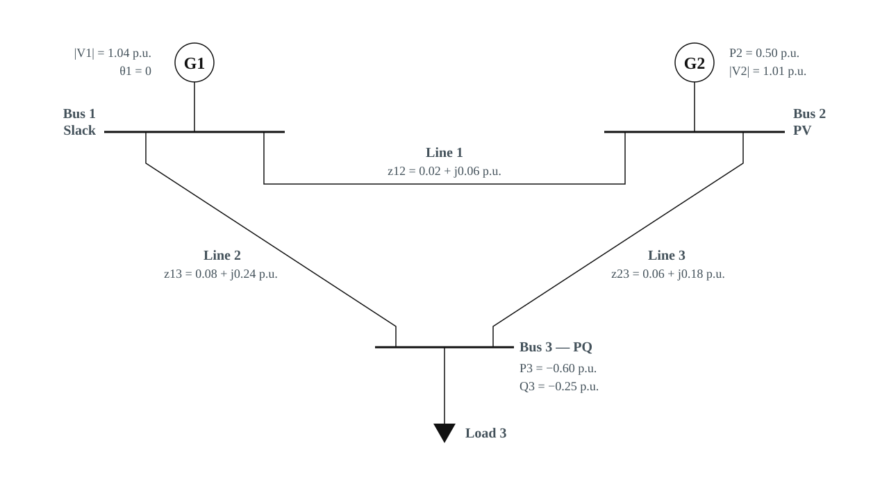

## What you will learn

After working through this tutorial, you should be able to:

- derive a two-terminal branch admittance model;
- include line charging, fixed shunts, and an off-nominal complex transformer tap;
- assemble a bus-admittance matrix by stamping branch contributions;
- recognise which structural properties of the matrix depend on modelling assumptions; and
- verify a small Y-bus matrix and its power injections with NumPy.

## 1. From a network diagram to one matrix equation

For a balanced three-phase system, work with positive-sequence, steady-state RMS phasors on a consistent per-unit base. Let $V_i$ be the voltage at bus $i$ and let $I_i$ be the net current flowing **from bus $i$ into the modelled network elements**. Stacking the bus quantities gives

$$
\mathbf{I}=\mathbf{Y}_{\mathrm{bus}}\mathbf{V}.
$$ {#eq-ybus-network}

The entry $Y_{ik}$ answers a local question: how does the current at bus $i$ change when the voltage at bus $k$ changes? A branch touches only its terminal buses, so each branch changes at most four entries of $\mathbf{Y}_{\mathrm{bus}}$. This local-to-global construction is called **stamping**.

::: {.callout-important}
This tutorial uses an injection convention: $S_i=V_i I_i^*$ is positive when a bus injects complex power into the network. A load therefore has a negative specified injection. Changing the direction chosen for $\mathbf I$ changes several signs, so establish the convention before comparing formulas from different sources.
:::

The bus ordering is arbitrary, but it must be used consistently in $\mathbf V$, $\mathbf I$, branch data, and every downstream calculation.

## 2. Primitive branch models

### 2.1 A series element

Consider a branch between buses $f$ and $t$ with series impedance

$$
z=r+\mathrm{j}x,
\qquad
y=\frac{1}{z}=g+\mathrm{j}b.
$$ {#eq-ybus-series-admittance}

Define $I_f$ and $I_t$ as currents entering the branch from its two terminal buses. Ohm's law gives

$$
\begin{bmatrix}
I_f\\ I_t
\end{bmatrix}
=
\underbrace{
\begin{bmatrix}
y & -y\\
-y & y
\end{bmatrix}}_{\mathbf Y_{ft}^{\mathrm{series}}}
\begin{bmatrix}
V_f\\ V_t
\end{bmatrix}.
$$ {#eq-ybus-series-primitive}

The diagonal terms are positive self-admittances; the off-diagonal terms are negative mutual admittances. Reversing the labels $f$ and $t$ does not change this series-only model.

### 2.2 Line charging and bus shunts

For a nominal $\pi$ model, let $b_c$ be the branch's **total** charging susceptance. Half of the charging admittance $\mathrm{j}b_c/2$ is placed at each terminal:

$$
\mathbf Y_{ft}^{\pi}
=
\begin{bmatrix}
y+\mathrm{j}b_c/2 & -y\\
-y & y+\mathrm{j}b_c/2
\end{bmatrix}.
$$ {#eq-ybus-pi-primitive}

A fixed bus shunt $y_i^{\mathrm{sh}}=g_i^{\mathrm{sh}}+\mathrm{j}b_i^{\mathrm{sh}}$ contributes only to $Y_{ii}$. Under the current convention, a positive susceptance draws the current $\mathrm{j}b_i^{\mathrm{sh}}V_i$ from the bus; its complex power $V_i(\mathrm{j}b_i^{\mathrm{sh}}V_i)^*$ has negative reactive part.

::: {.callout-note}
Some data formats store the charging value at each end rather than the total value. Applying another factor of one half is then a common source of error.
:::

### 2.3 Off-nominal and phase-shifting transformers

Place a complex tap

$$
t=\tau e^{\mathrm{j}\phi},
\qquad \tau>0,
$$ {#eq-ybus-complex-tap}

on the $f$ side of the branch, and take the voltage at the internal series terminal to be $V_f/t$. Referring the terminal currents to the bus side gives the primitive matrix

$$
\begin{bmatrix}
I_f\\ I_t
\end{bmatrix}
=
\underbrace{
\begin{bmatrix}
\dfrac{y+\mathrm{j}b_c/2}{|t|^2} & -\dfrac{y}{t^*}\\[8pt]
-\dfrac{y}{t} & y+\mathrm{j}b_c/2
\end{bmatrix}}_{
\begin{bmatrix}
Y_{ff} & Y_{ft}\\ Y_{tf} & Y_{tt}
\end{bmatrix}}
\begin{bmatrix}
V_f\\ V_t
\end{bmatrix}.
$$ {#eq-ybus-tap-primitive}

Setting $t=1$ recovers the line model in @eq-ybus-pi-primitive. A real off-nominal ratio scales the from-side diagonal and both mutual terms, while retaining $Y_{ft}=Y_{tf}$. A nonzero phase shift generally makes those mutual terms unequal.

The definition of tap direction and phase-shift sign is not universal. @Eq-ybus-tap-primitive follows a common power-flow convention used by MATPOWER-style branch models [@ybus_zimmerman2011]. If a data source defines $t$ on the opposite terminal or uses $V_f t$ instead of $V_f/t$, convert its data before using this stamp.

## 3. Assemble the global matrix

Start with an $n\times n$ complex zero matrix. For every branch $f\rightarrow t$, calculate its four primitive entries from @eq-ybus-tap-primitive and **add** them to the corresponding bus entries:

$$
\begin{aligned}
Y_{ff}^{\mathrm{bus}} &\mathrel{+}= Y_{ff}, &
Y_{ft}^{\mathrm{bus}} &\mathrel{+}= Y_{ft},\\
Y_{tf}^{\mathrm{bus}} &\mathrel{+}= Y_{tf}, &
Y_{tt}^{\mathrm{bus}} &\mathrel{+}= Y_{tt}.
\end{aligned}
$$ {#eq-ybus-stamp}

Finally, add every bus shunt to its diagonal entry. The `+=` operation in @eq-ybus-stamp is essential because several branches---including parallel circuits---may touch the same matrix entry.

| Model component | Entries changed |
|---|---|
| Series branch $f$--$t$ | $(f,f)$, $(f,t)$, $(t,f)$, $(t,t)$ |
| Line charging | Diagonals $(f,f)$ and $(t,t)$ |
| Fixed shunt at bus $i$ | Diagonal $(i,i)$ |
| Parallel branch | Adds to entries already stamped |

: Local contributions to the Y-bus matrix {#tbl-ybus-stamps}

For ordinary series branches with unit taps, no charging, and incidence matrix $\mathbf A$, the same assembly can be written compactly as

$$
\mathbf Y_{\mathrm{bus}}
=\mathbf A^{\mathsf T}\operatorname{diag}(\mathbf y)\mathbf A
+\operatorname{diag}(\mathbf y^{\mathrm{sh}}).
$$ {#eq-ybus-incidence}

Here each row of $\mathbf A$ contains one $+1$ and one $-1$. @Eq-ybus-incidence exposes the weighted graph-Laplacian structure, but @eq-ybus-stamp is the more general recipe when taps and phase shifters are present. Standard power-system texts develop both the primitive-network and singular-transformation viewpoints [@ybus_glover2017].

## 4. Structural properties---and their conditions

Properties often attributed to $\mathbf Y_{\mathrm{bus}}$ are not unconditional.

| Property | When it holds | Why it matters |
|---|---|---|
| Sparse | Each bus connects to only a small fraction of all buses | Sparse storage and factorisation scale to large networks |
| Complex symmetric, $\mathbf Y=\mathbf Y^{\mathsf T}$ | Reciprocal branches with no phase-shifting taps | Only one triangular part need be formed in some workflows |
| Hermitian, $\mathbf Y=\mathbf Y^{\mathsf H}$ | Generally **not** true for AC branch admittances | Do not select a Hermitian solver merely because the topology is reciprocal |
| Zero row sums | Series-only branches, unit taps, and no shunts or charging | The uniform-voltage vector lies in the nullspace |
| Nonsingular | Depends on connectivity, grounding/shunts, taps, and the retained buses | Never assume invertibility from the network size alone |

: Conditional structural properties of the Y-bus matrix {#tbl-ybus-properties}

The sparsity pattern encodes adjacency: for $i\ne k$, a nonzero $Y_{ik}$ usually means that at least one in-service branch directly connects buses $i$ and $k$. The numerical values encode electrical parameters, taps, and phase shifts. A zero mutual entry can nevertheless result from exact cancellation between parallel elements, so topology should still be retained explicitly.

::: {.callout-warning}
A symmetric Y-bus matrix is not usually Hermitian. Transposition leaves the complex admittances unchanged; conjugate transposition changes the sign of every susceptance. Confusing these two properties can lead to an invalid linear-solver choice.
:::

## 5. Worked three-bus example

Use the same series-impedance three-bus network as the [Newton--Raphson power-flow](newton-raphson-power-flow.qmd) and [power-flow versus state-estimation](power-flow-versus-state-estimation.qmd) tutorials. The per-unit branch impedances are

$$
z_{12}=0.02+\mathrm{j}0.06,
\qquad
z_{13}=0.08+\mathrm{j}0.24,
\qquad
z_{23}=0.06+\mathrm{j}0.18.
$$ {#eq-ybus-three-bus-impedances}

@fig-ybus-three-bus-single-line shows the meshed topology. For this worked example the branches are series-only: no line charging, no fixed bus shunts, and unit taps. Sections 2.2--2.3 still apply when those features are present; omitting them here keeps the stamp identical to the shared power-flow case.

{#fig-ybus-three-bus-single-line fig-align="center" width="100%"}

| From | To | $z=r+\mathrm{j}x$ | $b_c$ | $t$ |
|---:|---:|---:|---:|---:|
| 1 | 2 | $0.02+\mathrm{j}0.06$ | $0$ | $1$ |
| 1 | 3 | $0.08+\mathrm{j}0.24$ | $0$ | $1$ |
| 2 | 3 | $0.06+\mathrm{j}0.18$ | $0$ | $1$ |

: Three-bus series-only branch data {#tbl-ybus-three-bus-data}

Stamping the three series primitives gives

$$
\mathbf Y_{\mathrm{bus}}=
\begin{bmatrix}
 6.25000-\mathrm{j}18.75000 & -5.00000+\mathrm{j}15.00000 & -1.25000+\mathrm{j}3.75000\\
-5.00000+\mathrm{j}15.00000 &  6.66667-\mathrm{j}20.00000 & -1.66667+\mathrm{j}5.00000\\
-1.25000+\mathrm{j}3.75000 & -1.66667+\mathrm{j}5.00000 &  2.91667-\mathrm{j}8.75000
\end{bmatrix}.
$$ {#eq-ybus-three-bus-matrix}

Because every branch is reciprocal with a unit tap, $\mathbf Y_{\mathrm{bus}}$ is complex-symmetric: $Y_{ik}=Y_{ki}$. A nonzero phase-shifting tap would break that equality, as in @eq-ybus-tap-primitive.

### 5.1 Reproduce the stamp in Python

The following NumPy functions keep the primitive calculation separate from the global assembly. Bus identifiers in the example data are one-based to match @tbl-ybus-three-bus-data.

```{python}
#| label: lst-ybus-assembly
#| lst-cap: "Primitive branch model and dense Y-bus assembly"
#| code-summary: "Show the branch model and Y-bus assembly"

import numpy as np


def branch_admittance(
    impedance: complex,
    charging_susceptance: float = 0.0,
    tap: complex = 1.0 + 0.0j,
) -> np.ndarray:
    """Return the 2-by-2 from/to primitive admittance matrix."""
    if impedance == 0:
        raise ValueError("branch impedance must be nonzero")
    if tap == 0:
        raise ValueError("transformer tap must be nonzero")

    series = 1.0 / impedance
    charging = 0.5j * charging_susceptance

    return np.array(
        [
            [(series + charging) / abs(tap) ** 2, -series / tap.conjugate()],
            [-series / tap, series + charging],
        ],
        dtype=complex,
    )


def build_y_bus(
    n_bus: int,
    branches: list[dict],
    bus_shunts: np.ndarray | None = None,
) -> np.ndarray:
    """Assemble a dense Y-bus matrix from one-based branch records."""
    y_bus = np.zeros((n_bus, n_bus), dtype=complex)

    for branch in branches:
        f = branch["from_bus"] - 1
        t = branch["to_bus"] - 1
        if not (0 <= f < n_bus and 0 <= t < n_bus) or f == t:
            raise ValueError("branch terminals must be distinct valid buses")

        primitive = branch_admittance(
            branch["impedance"],
            branch.get("charging_susceptance", 0.0),
            branch.get("tap", 1.0 + 0.0j),
        )

        y_bus[f, f] += primitive[0, 0]
        y_bus[f, t] += primitive[0, 1]
        y_bus[t, f] += primitive[1, 0]
        y_bus[t, t] += primitive[1, 1]

    if bus_shunts is not None:
        shunts = np.asarray(bus_shunts, dtype=complex)
        if shunts.shape != (n_bus,):
            raise ValueError("bus_shunts must have one entry per bus")
        y_bus += np.diag(shunts)

    return y_bus
```

```{python}
#| label: lst-ybus-three-bus
#| lst-cap: "Three-bus test data and assembled matrix"

branches = [
    {
        "from_bus": 1,
        "to_bus": 2,
        "impedance": 0.02 + 0.06j,
    },
    {
        "from_bus": 1,
        "to_bus": 3,
        "impedance": 0.08 + 0.24j,
    },
    {
        "from_bus": 2,
        "to_bus": 3,
        "impedance": 0.06 + 0.18j,
    },
]

y_bus = build_y_bus(3, branches)

np.set_printoptions(precision=5, suppress=True)
print(y_bus)
```

The output agrees with @eq-ybus-three-bus-matrix. For a large case, the same stamp should target a sparse matrix builder rather than a dense NumPy array.

## 6. Verify currents and power injections

Matrix entries are easy to mis-index, especially around transformer taps. A stronger test than visually checking the matrix is to compare two independently organised current calculations:

1. calculate $\mathbf I=\mathbf Y_{\mathrm{bus}}\mathbf V$; and
2. calculate every branch's two terminal currents, accumulate them at the buses, and add bus-shunt currents.

For illustration, take

$$
\mathbf V=
\begin{bmatrix}
1.04\\
1.01e^{-\mathrm{j}3^\circ}\\
0.98e^{-\mathrm{j}7^\circ}
\end{bmatrix}.
$$ {#eq-ybus-example-voltage}

```{python}
#| label: lst-ybus-current-check
#| lst-cap: "Current reconstruction and bus power injections"

voltage = np.array(
    [
        1.04,
        1.01 * np.exp(-1j * np.deg2rad(3.0)),
        0.98 * np.exp(-1j * np.deg2rad(7.0)),
    ]
)

matrix_current = y_bus @ voltage
assembled_current = np.zeros(3, dtype=complex)

for branch in branches:
    terminals = np.array([branch["from_bus"] - 1, branch["to_bus"] - 1])
    primitive = branch_admittance(
        branch["impedance"],
        branch.get("charging_susceptance", 0.0),
        branch.get("tap", 1.0 + 0.0j),
    )
    assembled_current[terminals] += primitive @ voltage[terminals]

current_error = np.max(np.abs(matrix_current - assembled_current))

power_injection = voltage * matrix_current.conjugate()

print(f"maximum current reconstruction error: {current_error:.3e}")
for bus, power in enumerate(power_injection, start=1):
    print(f"bus {bus}: P = {power.real:+.5f}, Q = {power.imag:+.5f} p.u.")
print(f"total active injection: {power_injection.real.sum():.5f} p.u.")
```

The bus power calculation uses

$$
\mathbf S
=\mathbf V\odot\left(\mathbf Y_{\mathrm{bus}}\mathbf V\right)^*,
$$ {#eq-ybus-power-injection}

where $\odot$ denotes elementwise multiplication. The small positive total active injection in this passive example is the network's resistive loss.

@Eq-ybus-power-injection is the bridge from network assembly to nonlinear power-flow equations. The [Newton--Raphson power-flow tutorial](newton-raphson-power-flow.qmd) develops that next step on this same three-bus network. Keep the primitive branch matrices as well as $\mathbf Y_{\mathrm{bus}}$ when individual terminal currents or branch power flows are required.

## 7. Practical checks

Before trusting an assembled matrix, check the following:

1. **Base consistency.** Convert every impedance, charging value, and shunt to the same per-unit base before stamping.
2. **Terminal convention.** Confirm which side owns each tap and whether the source defines $t$, $1/t$, $+\phi$, or $-\phi$.
3. **Accumulation.** Ensure parallel branches add to existing entries rather than overwrite them.
4. **Expected structure.** Test symmetry only for a case whose taps and models should produce symmetry.
5. **Row sums under a controlled model.** For unit-tap, series-only branches without shunts, $\mathbf Y_{\mathrm{bus}}\mathbf 1$ should be zero to numerical precision.
6. **Independent current reconstruction.** Compare matrix currents with accumulated primitive-branch currents at a random complex voltage vector.
7. **Power balance.** For passive series elements and lossless ideal transformers, the total active injection should equal nonnegative resistive losses, within roundoff.

::: {.callout-tip}
Create tiny automated cases that isolate one feature at a time: one line, one shunt, one magnitude tap, one phase shift, and two parallel circuits. These tests localise convention errors far more effectively than debugging a large production network.
:::

## 8. Takeaways

- The Y-bus matrix is assembled from local two-terminal admittance models.
- Lines, charging shunts, fixed bus shunts, and complex taps each have a precise stamp.
- Sparsity follows from network locality, while symmetry, zero row sums, and invertibility require additional assumptions.
- A phase-shifting tap can make $Y_{ft}$ and $Y_{tf}$ unequal without violating the model.
- Reconstructing currents from primitive branches is a powerful end-to-end validation of the assembled matrix.
- Once $\mathbf Y_{\mathrm{bus}}$ is correct, bus currents and complex-power injections follow directly from the voltage phasors.

## References {.unnumbered}

::: {#refs}
:::
