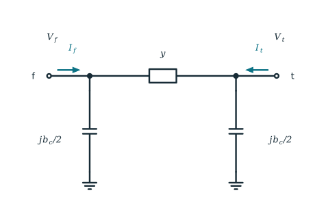

## What you will learn

- build the network admittance matrix $\mathbf Y_{\mathrm{bus}}$ from topology and branch data;
- read connectivity, series and shunt parameters from $\mathbf Y_{\mathrm{bus}}$; 
- learn the structural properties of $\mathbf Y_{\mathrm{bus}}$; and
- check a small three-bus example in Python.

## 1. The network equation

Work with a balanced three-phase network in positive sequence, using steady-state RMS phasors on one common per-unit base. Write $V_i$ for the voltage at bus $i$, and $I_i$ for the net current that leaves that bus and enters the modelled network. Stacking all buses gives one linear equation:

$$
\mathbf{I}=\mathbf{Y}_{\mathrm{bus}}\mathbf{V}.
$$ {#eq-ybus-network}

The matrix $\mathbf Y_{\mathrm{bus}}$ is the **bus-admittance matrix**, often called the **Y-bus**. Entry $Y_{ik}$ tells how the current at bus $i$ responds when the voltage at bus $k$ changes.

Complex power at a bus is $S_i=V_i I_i^*$. Here $S_i$ is positive when the bus injects power into the network, so a load has a negative specified injection. The order of the buses is arbitrary, but $\mathbf V$, $\mathbf I$, and the branch data must all use the same order.

A branch between buses $f$ and $t$ affects only four matrix entries: $(f,f)$, $(f,t)$, $(t,f)$, and $(t,t)$. Building $\mathbf Y_{\mathrm{bus}}$ means adding each branch's contribution into those entries. 

## 2. Branch models

A transmission line between buses $f$ and $t$ is modelled by a **nominal $\pi$ circuit**. Let $z=r+\mathrm{j}x$ be the series impedance, $y=1/z$ the series admittance, and $b_c$ the line's **total** charging susceptance, with half placed at each end. If $I_f$ and $I_t$ are the currents entering the branch from those two buses,

{#fig-ybus-nominal-pi fig-align="center" width="72%"}

$$
\begin{bmatrix}
I_f\\ I_t
\end{bmatrix}
=
\underbrace{
\begin{bmatrix}
y+\mathrm{j}b_c/2 & -y\\
-y & y+\mathrm{j}b_c/2
\end{bmatrix}
}_{\mathbf Y_{ft}^{\pi}}
\begin{bmatrix}
V_f\\ V_t
\end{bmatrix}.
$$ {#eq-ybus-pi-primitive}

::: {.callout-note}
The diagonal entries of $\mathbf Y_{ft}^{\pi}$ are self-admittances. The off-diagonal entries are mutual admittances with the opposite sign. A fixed shunt at bus $i$, written $y_i^{\mathrm{sh}}$, is separate from line charging: it changes only the global diagonal entry $Y_{ii}$. Watch the data format: some files store charging once as a total $b_c$, while others already store the value at each end. Halving an already-halved value is a common mistake.
:::

## 3. Assembly at Once

Start with an $n\times n$ matrix of zeros. For every branch, compute the four entries in @eq-ybus-pi-primitive and add them to the matching positions in $\mathbf Y_{\mathrm{bus}}$. Then add each bus shunt to its diagonal. If two branches share the same pair of buses, their contributions must be **added**, not overwritten.

The same bookkeeping can be written in matrix form. Give every branch an arbitrary direction from one terminal to the other, and build a matrix $\mathbf A$ with one row per branch and one column per bus. In each row place $+1$ at the starting bus, $-1$ at the ending bus, and zeros elsewhere. Let the branch vector

$$
\mathbf y
=
\begin{bmatrix}
y_1\\ y_2\\ \vdots\\ y_m
\end{bmatrix}
$$ {#eq-ybus-branch-admittance-vector}

hold the **series** admittance of each of the $m$ branches, in the same order as the rows of $\mathbf A$, with $y_\ell=1/z_\ell$ for branch $\ell$. Let

$$
\mathbf y^{\mathrm{sh}}
=
\begin{bmatrix}
y_1^{\mathrm{sh}}\\ y_2^{\mathrm{sh}}\\ \vdots\\ y_n^{\mathrm{sh}}
\end{bmatrix}
$$ {#eq-ybus-shunt-admittance-vector}

hold the fixed shunt at each of the $n$ buses (use zero when a bus has no shunt). Then [@ybus_glover2017]

$$
\mathbf Y_{\mathrm{bus}}
=\mathbf A^{\mathsf T}\operatorname{diag}(\mathbf y)\mathbf A
+\operatorname{diag}(\mathbf y^{\mathrm{sh}}).
$$ {#eq-ybus-incidence}

The product $\mathbf A^{\mathsf T}\operatorname{diag}(\mathbf y)\mathbf A$ does the series-branch additions all at once; the second term adds fixed bus shunts. Line charging from @eq-ybus-pi-primitive is not included there: for each branch, still add $\mathrm{j}b_c/2$ to both terminal diagonals. Building branch by branch with the full $\pi$ primitive already does that automatically.

## 4. What the Y-bus tells

The bus-admittance matrix is a compact description of the **network graph and its branch data** together:

- **Connectivity.** For $i\ne k$, a nonzero $Y_{ik}$ means at least one in-service branch joins buses $i$ and $k$. A zero pattern (apart from rare exact cancellations) matches the single-line topology.
- **Series parameters.** The off-diagonal entry is $Y_{ik}=-y_{ik}$ with series admittance $y_{ik}=1/z_{ik}$, so the numerical value carries the series impedance of that line (or the parallel combination of several lines).
- **Shunt parameters.** Fixed bus shunts $y_i^{\mathrm{sh}}$ and line charging $\mathrm{j}b_c/2$ appear only on the diagonals. The diagonal $Y_{ii}$ is the sum of all series admittances connected to bus $i$, plus every shunt and charging term at that bus.

Useful structural consequences follow:

- The matrix is **sparse**, because each bus connects to only a few others.
- For ordinary reciprocal branches it is **complex-symmetric**, $\mathbf Y=\mathbf Y^{\mathsf T}$, so $Y_{ik}=Y_{ki}$.
- It is usually **not Hermitian**: taking the conjugate transpose flips the sign of every susceptance.
- The sum of row $i$ is the total admittance from bus $i$ to ground. Series branches cancel in that sum; fixed shunts and line charging do not. The rows therefore sum to zero only when there is no path to ground.
- Without a path to ground (no shunts and no charging), $\mathbf Y_{\mathrm{bus}}$ is singular. A disconnected island is singular as well.

## 5. Three-bus example

Use the same three-bus topology and series impedances as the [Newton--Raphson power-flow](newton-raphson-power-flow.qmd) tutorial, and add nonzero line charging so the branch model is the full $\pi$ stamp of @eq-ybus-pi-primitive:

$$
\begin{aligned}
z_{12}&=0.02+\mathrm{j}0.06,&
b_{c,12}&=0.060,\\
z_{13}&=0.08+\mathrm{j}0.24,&
b_{c,13}&=0.025,\\
z_{23}&=0.06+\mathrm{j}0.18,&
b_{c,23}&=0.040.
\end{aligned}
$$ {#eq-ybus-three-bus-data}

Each $z_{ik}$ is still the **series** impedance only; $y_{ik}=1/z_{ik}$. Each $b_{c,ik}$ is the branch's **total** charging susceptance, split as $\mathrm{j}b_{c,ik}/2$ at each end. There are no fixed bus shunts.

{#fig-ybus-three-bus-single-line fig-align="center" width="100%"}

Adding the three $\pi$-branch contributions produces

$$
\mathbf Y_{\mathrm{bus}}=
\begin{bmatrix}
 6.25000-\mathrm{j}18.70750 & -5.00000+\mathrm{j}15.00000 & -1.25000+\mathrm{j}3.75000\\
-5.00000+\mathrm{j}15.00000 &  6.66667-\mathrm{j}19.95000 & -1.66667+\mathrm{j}5.00000\\
-1.25000+\mathrm{j}3.75000 & -1.66667+\mathrm{j}5.00000 &  2.91667-\mathrm{j}8.71750
\end{bmatrix}.
$$ {#eq-ybus-three-bus-matrix}

Charging appears only on the diagonals: bus $i$ receives $\mathrm{j}b_{c,ik}/2$ from each incident branch $i$--$k$. Off-diagonal entries stay $-y_{ik}$. Reciprocal branches still give complex symmetry, $Y_{ik}=Y_{ki}$, not the Hermitian property $Y_{ik}=Y_{ki}^*$.

The sum of row $i$, $\sum_k Y_{ik}$, is the total admittance from bus $i$ to ground: series branches cancel in that sum, while charging does not. With charging present, the rows therefore do not sum to zero.

The Python cell below builds @eq-ybus-three-bus-matrix in two ways and checks that they agree: first by adding each $\pi$ primitive branch by branch, then all at once with the incidence form of @eq-ybus-incidence plus charging on the diagonals. It also reports a **row-sum residual**, $\max_i\bigl|\sum_k Y_{ik}\bigr|$, to confirm that those ground paths were assembled as intended—nonzero here, equal to the largest bus ground-admittance magnitude from line charging.

```{python}
#| label: lst-ybus-assembly
#| lst-cap: "Assemble Y-bus branch by branch and all at once"
#| code-summary: "Compare branch-wise and incidence-matrix assembly"

import numpy as np

n_bus = 3
branches = [
    # from_bus, to_bus, series impedance, total charging susceptance b_c
    (1, 2, 0.02 + 0.06j, 0.060),
    (1, 3, 0.08 + 0.24j, 0.025),
    (2, 3, 0.06 + 0.18j, 0.040),
]

# --- Branch-by-branch assembly with the pi primitive ---
y_bus_branchwise = np.zeros((n_bus, n_bus), dtype=complex)
for from_bus, to_bus, impedance, charging in branches:
    f, t = from_bus - 1, to_bus - 1
    y = 1.0 / impedance
    half_charging = 0.5j * charging
    y_bus_branchwise[f, f] += y + half_charging
    y_bus_branchwise[t, t] += y + half_charging
    y_bus_branchwise[f, t] -= y
    y_bus_branchwise[t, f] -= y

# --- Assembly at once: A.T @ diag(y) @ A plus charging on the diagonals ---
n_branch = len(branches)
incidence = np.zeros((n_branch, n_bus), dtype=float)
series_admittances = np.zeros(n_branch, dtype=complex)
charging_on_buses = np.zeros(n_bus, dtype=complex)

for branch_index, (from_bus, to_bus, impedance, charging) in enumerate(branches):
    f, t = from_bus - 1, to_bus - 1
    incidence[branch_index, f] = 1.0
    incidence[branch_index, t] = -1.0
    series_admittances[branch_index] = 1.0 / impedance
    charging_on_buses[f] += 0.5j * charging
    charging_on_buses[t] += 0.5j * charging

y_bus_at_once = (
    incidence.T @ np.diag(series_admittances) @ incidence
    + np.diag(charging_on_buses)
)

np.set_printoptions(precision=5, suppress=True)
print("branch-by-branch Y-bus:")
print(y_bus_branchwise)
print("\nassembly-at-once Y-bus:")
print(y_bus_at_once)
print(
    "\nmax |branchwise - at-once|:",
    f"{np.max(np.abs(y_bus_branchwise - y_bus_at_once)):.3e}",
)

y_bus = y_bus_at_once
voltage = np.array(
    [
        1.04,
        1.01 * np.exp(-1j * np.deg2rad(3.0)),
        0.98 * np.exp(-1j * np.deg2rad(7.0)),
    ]
)
current = y_bus @ voltage
power = voltage * current.conjugate()

print(f"\nrow-sum residual (max |ground admittance|): {np.max(np.abs(y_bus.sum(axis=1))):.5f}")
for bus, injection in enumerate(power, start=1):
    print(f"bus {bus}: P = {injection.real:+.5f}, Q = {injection.imag:+.5f} p.u.")
print(f"total active injection (= resistive loss): {power.real.sum():.5f} p.u.")
```

Both assemblies match @eq-ybus-three-bus-matrix. Once the voltages are known, the bus current and complex power follow from

$$
\mathbf S
=\mathbf V\odot\left(\mathbf Y_{\mathrm{bus}}\mathbf V\right)^*,
$$ {#eq-ybus-power-injection}

where $\odot$ means elementwise multiplication. The printed bus $P$ and $Q$ values are those injections for the chosen voltages. The printed **total active injection** is exactly the network **resistive loss**:

$$
\sum_i P_i
=\sum_{\text{branches}}\lvert I_{\mathrm{series}}\rvert^2\,r
>0
$$

in this passive example (about $0.05$ p.u.). Ideal line charging exchanges reactive power only and does not change $\sum_i P_i$. 

## 6. Takeaways

- $\mathbf Y_{\mathrm{bus}}$ encodes which buses are connected and the series and shunt admittances on those connections.
- Sparsity comes from the topology. Symmetry, zero row sums, and invertibility depends.
- With a correct Y-bus and known voltages, bus currents and complex-power injections are trivial to calculate.

## References {.unnumbered}

::: {#refs}
:::
